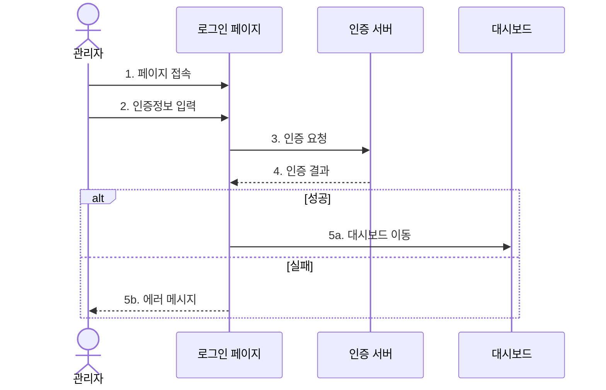
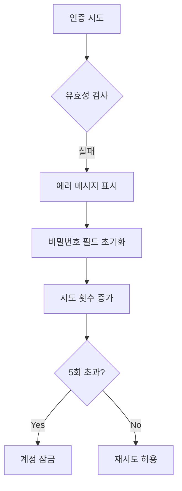
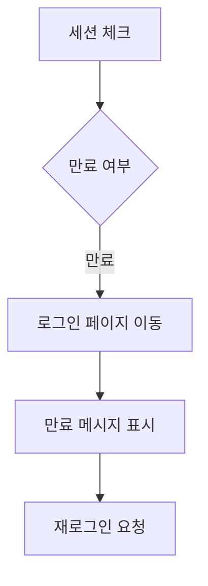
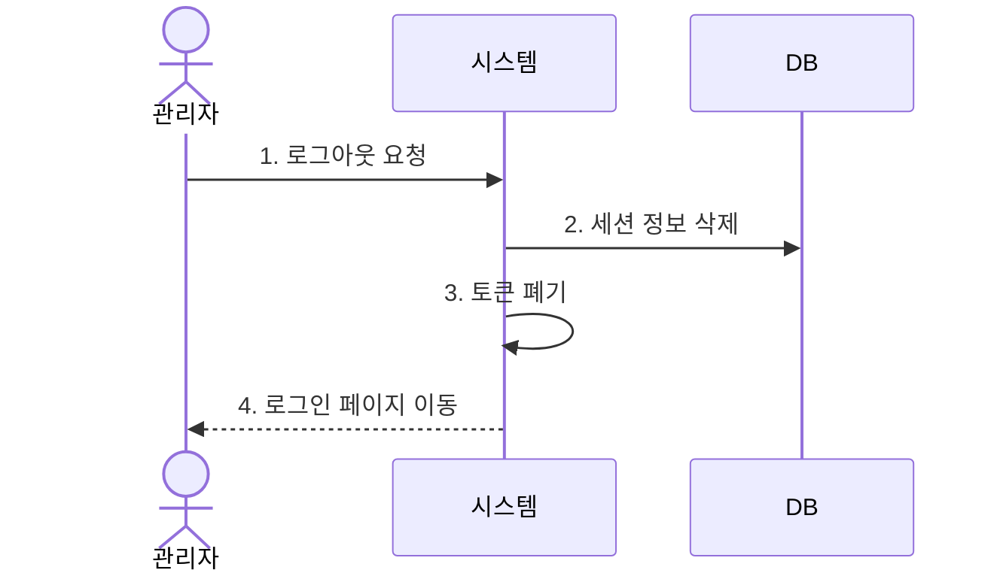
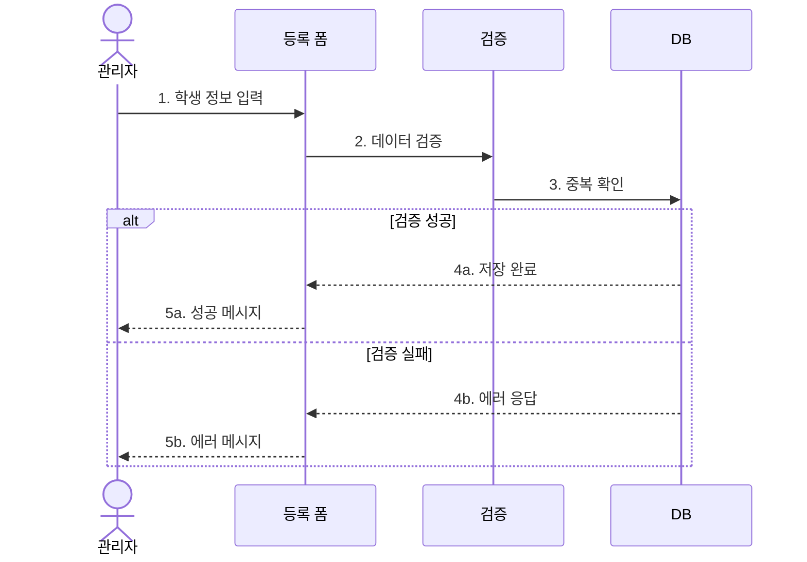
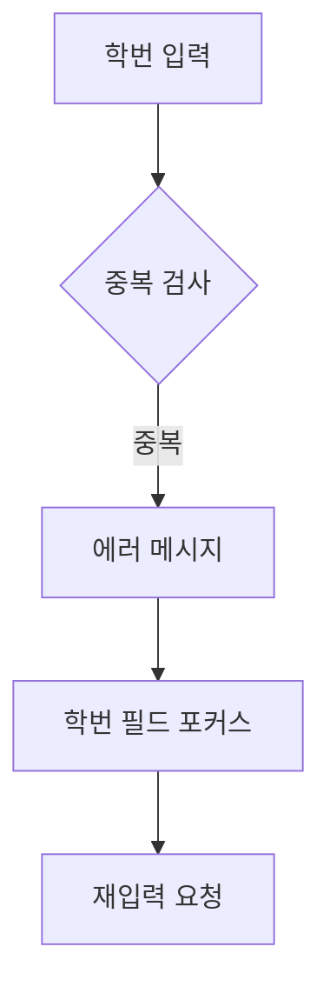

# 🔧 기능 명세서

<div align="center">


</div>

## 🔐 1. 인증 시스템

### 1.1 로그인 (AUTH-001)

#### 📝 개요
관리자가 시스템에 접근하기 위한 인증 절차를 수행합니다.

#### ⚡ 기능 흐름도


#### ✅ 선행 조건
| 조건 | 설명 |
|------|------|
| 계정 등록 | 관리자 계정이 시스템에 등록되어 있어야 함 |
| 쿠키 설정 | 브라우저의 쿠키 사용이 가능해야 함 |
| 네트워크 | 인터넷 연결이 가능해야 함 |

#### 🔄 정상 흐름
1. **페이지 접속**
   - URL을 통한 로그인 페이지 접근
   - 세션 만료 시 자동 리다이렉트

2. **인증 정보 입력**
   - 아이디 입력 (이메일 형식)
   - 비밀번호 입력 (8자 이상)
   - 자동 로그인 옵션 선택

3. **인증 처리**
   - 입력값 유효성 검증
   - 서버 측 인증 처리
   - JWT 토큰 발급

4. **세션 생성**
   - 사용자 세션 생성
   - 권한 정보 로드
   - 접근 토큰 저장

5. **리다이렉트**
   - 대시보드로 자동 이동
   - 환영 메시지 표시
   - 최근 알림 로드

#### 🔄 대안 흐름

##### 1️⃣ 잘못된 인증 정보


##### 2️⃣ 세션 만료


##### 3️⃣ 계정 잠금
| 상황 | 조치 사항 |
|------|-----------|
| 5회 실패 | - 계정 일시 잠금 (30분)<br>- 관리자 알림 발송<br>- 로그 기록 |
| 비밀번호 초기화 요청 | - 이메일 인증<br>- 임시 비밀번호 발급<br>- 최초 로그인 시 변경 강제 |

#### 🧪 테스트 케이스
| ID | 시나리오 | 입력 | 기대 결과 | 우선순위 |
|----|----------|------|------------|----------|
| TC-AUTH-001-1 | 정상 로그인 | ID: admin@cku.ac.kr<br>PW: admin123! | - 로그인 성공<br>- 대시보드 이동<br>- 환영 메시지 | 높음 |
| TC-AUTH-001-2 | 잘못된 비밀번호 | ID: admin@cku.ac.kr<br>PW: wrong123! | - 인증 실패<br>- 에러 메시지<br>- 시도 횟수 증가 | 높음 |
| TC-AUTH-001-3 | 존재하지 않는 계정 | ID: invalid@cku.ac.kr<br>PW: test123! | - 인증 실패<br>- 에러 메시지 | 중간 |
| TC-AUTH-001-4 | 빈 값 제출 | ID: ""<br>PW: "" | - 유효성 검사 실패<br>- 필수 입력 안내 | 중간 |
| TC-AUTH-001-5 | 계정 잠금 | 5회 연속 실패 | - 계정 잠금<br>- 관리자 문의 안내 | 높음 |

#### 🎨 UI 프로토타입
```
+------------------+
|    로그인        |
+------------------+
| 이메일           |
| [            ]   |
|                  |
| 비밀번호         |
| [            ]   |
|                  |
| [ ] 자동 로그인  |
|                  |
| [  로그인    ]   |
|                  |
| 비밀번호 찾기    |
+------------------+
```

### 1.2 로그아웃 (AUTH-002)

#### 📝 개요
관리자가 시스템에서 안전하게 로그아웃하는 기능을 제공합니다.

#### ⚡ 기능 흐름도


#### ✅ 선행 조건
| 조건 | 설명 |
|------|------|
| 로그인 상태 | 사용자가 로그인되어 있어야 함 |
| 유효 세션 | 세션이 만료되지 않은 상태여야 함 |

#### 🔄 정상 흐름
1. **로그아웃 요청**
   - 로그아웃 버튼 클릭
   - API 요청 전송

2. **세션 종료**
   - 서버 세션 삭제
   - 클라이언트 토큰 제거
   - 캐시 데이터 정리

3. **페이지 이동**
   - 로그인 페이지 리다이렉트
   - 로그아웃 완료 메시지

#### 🧪 테스트 케이스
| ID | 시나리오 | 동작 | 기대 결과 | 우선순위 |
|----|----------|------|------------|----------|
| TC-AUTH-002-1 | 정상 로그아웃 | 로그아웃 버튼 클릭 | - 세션 종료<br>- 로그인 페이지 이동<br>- 완료 메시지 | 높음 |
| TC-AUTH-002-2 | 세션 만료 후 로그아웃 | 만료된 세션에서 로그아웃 | - 로그인 페이지 이동<br>- 세션 만료 메시지 | 중간 |

## 👥 2. 학생 관리

### 2.1 학생 등록 (STU-001)

#### 📝 개요
새로운 학생 정보를 시스템에 등록하고 관리하는 기능을 제공합니다.

#### ⚡ 기능 흐름도


#### ✅ 선행 조건
| 조건 | 설명 |
|------|------|
| 권한 확인 | 학생 등록 권한이 있어야 함 |
| 필수 정보 | 기본 학생 정보가 준비되어 있어야 함 |
| 호실 여유 | 배정 가능한 호실이 있어야 함 |

#### 🔄 정상 흐름
1. **정보 입력**
   - 기본 정보
     * 이름
     * 학번
     * 학과
     * 학년
   - 연락처 정보
     * 전화번호
     * 이메일
     * 비상연락처
   - 기숙사 정보
     * 배정 호실
     * 입사 일자
     * 퇴사 예정일

2. **정보 검증**
   - 필수 항목 확인
   - 형식 검증
   - 중복 확인

3. **데이터 저장**
   - DB 저장
   - 인덱스 갱신
   - 로그 기록

4. **완료 처리**
   - 성공 메시지
   - 목록 갱신
   - 상세 페이지 이동

#### 🔄 대안 흐름

##### 1️⃣ 중복 학번


##### 2️⃣ 필수 정보 누락
| 필드 | 검증 규칙 | 에러 메시지 |
|------|-----------|-------------|
| 이름 | 2자 이상 | "이름을 입력해주세요" |
| 학번 | 8자리 숫자 | "올바른 학번을 입력해주세요" |
| 연락처 | 전화번호 형식 | "올바른 연락처를 입력해주세요" |
| 호실 | 필수 선택 | "호실을 선택해주세요" |

##### 3️⃣ 잘못된 형식
| 필드 | 형식 | 예시 |
|------|------|------|
| 이메일 | email | student@cku.ac.kr |
| 전화번호 | phone | 010-1234-5678 |
| 학번 | number | 20240001 |
| 생년월일 | date | 2000-01-01 |

#### 🧪 테스트 케이스
| ID | 시나리오 | 입력 | 기대 결과 | 우선순위 |
|----|----------|------|------------|----------|
| TC-STU-001-1 | 정상 등록 | 모든 필수 정보 입력 | - 등록 성공<br>- 목록 갱신<br>- 성공 메시지 | 높음 |
| TC-STU-001-2 | 중복 학번 | 기존 학번 입력 | - 등록 실패<br>- 중복 메시지<br>- 학번 포커스 | 높음 |
| TC-STU-001-3 | 필수 정보 누락 | 일부 정보만 입력 | - 등록 실패<br>- 필수 입력 안내 | 중간 |
| TC-STU-001-4 | 잘못된 전화번호 | "010-123-4567" | - 형식 오류<br>- 재입력 요청 | 중간 |
| TC-STU-001-5 | 잘못된 이메일 | "invalid.email" | - 형식 오류<br>- 재입력 요청 | 중간 |

#### 🎨 UI 프로토타입
```
+------------------------+
|    학생 등록           |
+------------------------+
| 기본 정보             |
| 이름 [          ]     |
| 학번 [          ]     |
| 학과 [          ]     |
| 학년 [          ]     |
|                       |
| 연락처 정보           |
| 전화 [          ]     |
| 이메일[          ]     |
| 비상 [          ]     |
|                       |
| 기숙사 정보           |
| 호실 [          ]     |
| 입사 [          ]     |
| 퇴사 [          ]     |
|                       |
| [  저장  ] [  취소  ] |
+------------------------+
```

[이하 다른 기능들도 같은 형식으로 계속됩니다...] 