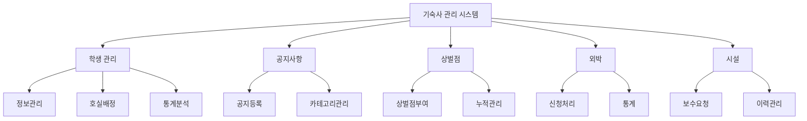
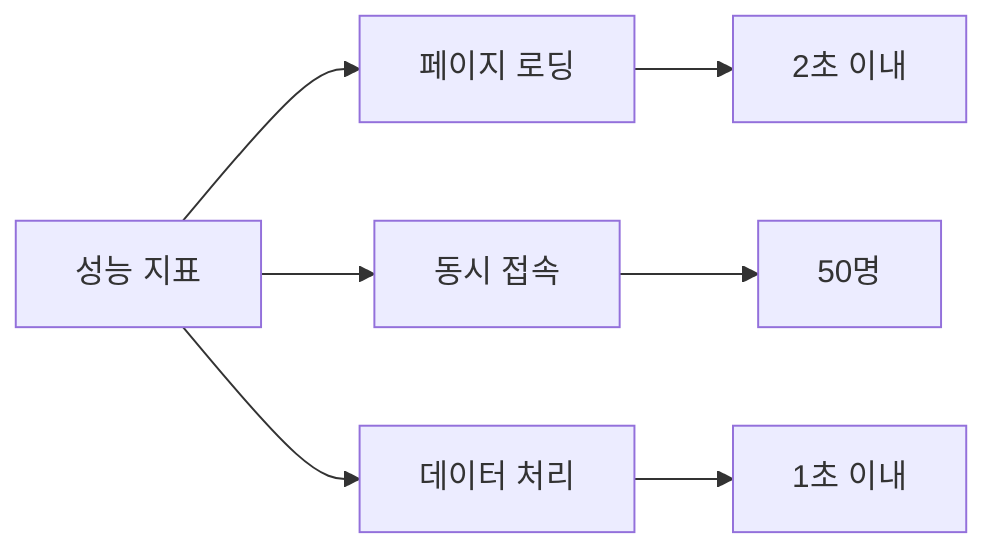
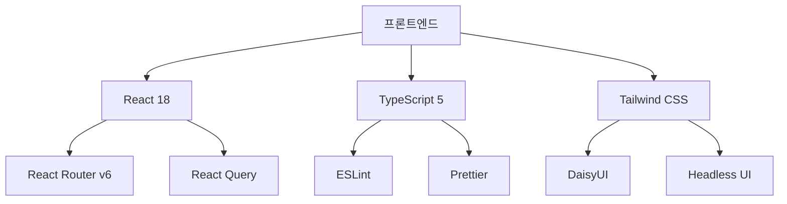
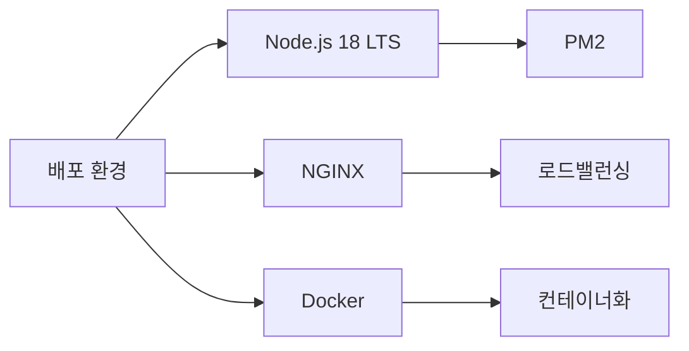
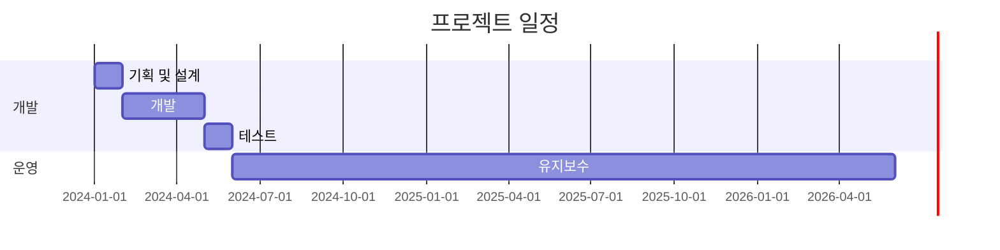
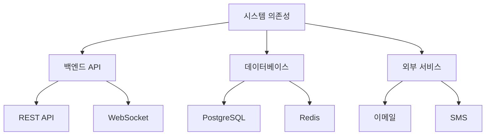

# 📋 요구사항 분석서

## 📌 1. 프로젝트 개요

### 🎯 1.1 프로젝트 목적
| 목적 | 설명 |
|------|------|
| 📱 디지털화 | 기숙사 행정업무의 완전한 디지털 전환 |
| 📈 효율성 | 학생 관리 프로세스 최적화 및 자동화 |
| 💾 데이터 관리 | 체계적인 데이터 수집, 분석, 보관 시스템 구축 |
| ⚡ 업무 개선 | 행정 처리 시간 50% 이상 단축 |

### 🔍 1.2 프로젝트 범위

### 👥 1.3 대상 사용자
- **주 사용자**
  - 🏢 기숙사 행정실 관리자
  - 👨‍💼 기숙사 사감
  - 👩‍💼 기숙사 운영 담당자

## 💻 2. 시스템 요구사항

### ⚙️ 2.1 기능적 요구사항

#### 🔐 2.1.1 인증 시스템
| 기능 | 상세 설명 | 우선순위 |
|------|-----------|----------|
| 로그인/로그아웃 | - 이메일/비밀번호 기반 인증 - 2단계 인증(선택) - 자동 로그아웃(30분) | 높음 |
| 세션 관리 | - JWT 토큰 기반 인증 - 리프레시 토큰 구현 - 동시 접속 제한 | 높음 |
| 권한 관리 | - RBAC 기반 권한 시스템 - 메뉴별 접근 권한 설정 - 권한 그룹 관리 | 중간 |

#### 👥 2.1.2 학생 관리
| 기능 | 상세 설명 | 우선순위 |
|------|-----------|----------|
| 학생 정보 | - 기본 정보 관리 - 학적 정보 연동 - 비상연락처 관리 | 높음 |
| 호실 관리 | - 자동 배정 알고리즘 - 수동 배정 기능 - 룸메이트 매칭 | 높음 |
| 통계 분석 | - 층별/동별 통계 - 학과별 분포도 - 거주 기간 분석 | 중간 |

#### 2.1.3 공지사항 관리
- 공지사항 등록/수정/삭제
- 카테고리별 공지사항 관리
- 중요 공지사항 표시
- 공지사항 이력 관리
- 공지사항 검색 기능

#### 2.1.4 상벌점 관리
- 상벌점 부여/수정/삭제
- 학생별 상벌점 이력 관리
- 상벌점 통계 및 리포트
- 벌점 기준 관리
- 누적 벌점에 따른 조치사항 관리

#### 2.1.5 외박 관리
- 외박 신청 승인/거절
- 외박 이력 관리
- 외박 통계 관리
- 특이사항 기록
- 긴급 외박 처리

#### 2.1.6 시설 관리
- 고장/수리 요청 관리
- 수리 진행상태 관리
- 시설 점검 일정 관리
- 수리 이력 관리
- 시설 유지보수 예산 관리

### 🔧 2.2 비기능적 요구사항

#### ⚡ 2.2.1 성능 요구사항

#### 🔒 2.2.2 보안 요구사항
| 요구사항 | 구현 방식 | 중요도 |
|----------|-----------|---------|
| 인증 보안 | - bcrypt 암호화 - 비밀번호 정책 적용 - 로그인 시도 제한 | 최상 |
| 통신 보안 | - HTTPS 적용 - SSL 인증서 관리 - API 엔드포인트 보안 | 최상 |
| 데이터 보안 | - 중요 정보 암호화 - 접근 로그 기록 - 정기 백업 | 높음 |

#### 🎨 2.2.3 사용성 요구사항
| 구분 | 요구사항 | 상세 설명 |
|------|----------|-----------|
| UI/UX | - 반응형 디자인 - 다크모드 - 직관적 인터페이스 | - 모든 디바이스 지원 - 사용자 선호도 저장 - UX 가이드라인 준수 |
| 접근성 | - 키보드 접근성 - 스크린리더 - 색상 대비 | - 단축키 지원 - ARIA 레이블 적용 - WCAG 2.1 준수 |
| 다국어 | - 한국어 - 영어 - 자동 언어 감지 | - 동적 언어 전환 - 언어별 리소스 관리 - i18n 시스템 |

#### 🎨 2.2.4 유지보수성 요구사항
- 모듈화된 코드 구조
- 명확한 코드 문서화
- 버전 관리 시스템 사용
- 에러 로깅 시스템
- 자동화된 테스트
- 배포 자동화
- 백업 시스템
- 모니터링 시스템

## 🛠️ 3. 기술 스택

### 🎨 3.1 프론트엔드

### 🔧 3.2 개발 도구
| 도구 | 버전 | 용도 |
|------|------|------|
| Vite | 4.x | 빌드 도구 |
| ESLint | 8.x | 코드 품질 |
| Prettier | 2.x | 코드 포맷팅 |
| Husky | 8.x | Git Hooks |
| Jest | 29.x | 단위 테스트 |

### 🚀 3.3 배포 환경

## ⚠️ 4. 제약사항

### 🔧 4.1 기술적 제약사항
| 항목 | 제약사항 | 대응 방안 |
|------|----------|-----------|
| 브라우저 | - Chrome 90+ - Safari 14+ - Firefox 88+ - Edge 90+ | - 크로스 브라우징 테스트 - 폴리필 적용 - 브라우저 체크 |
| 해상도 | - 최소: 1280 x 720 - 권장: 1920 x 1080 | - 반응형 디자인 - 미디어 쿼리 - 뷰포트 최적화 |
| 네트워크 | - 최소: 1Mbps - 권장: 5Mbps | - 이미지 최적화 - 코드 스플리팅 - 캐싱 전략 |

### 📋 4.2 관리적 제약사항

## 📝 5. 가정 및 의존성

### 📌 5.1 가정사항
- 💻 **사용자 환경**
  - 기본적인 웹 브라우저 사용 능력
  - 안정적인 인터넷 연결
  - 최신 브라우저 사용

- 🔒 **보안 정책**
  - 기관 보안 정책 준수
  - 개인정보 보호법 준수
  - 정보보안 교육 이수

### 🔄 5.2 의존성

## 📊 6. 성과 지표

### 📈 6.1 정량적 지표
| 지표 | 목표 | 측정 방법 |
|------|------|-----------|
| 업무 처리 시간 | 50% 감소 | 처리 시간 로그 분석 |
| 사용자 만족도 | 85점 이상 | 정기 설문조사 |
| 시스템 가용성 | 99.9% | 모니터링 시스템 |
| 오류 발생률 | 1% 미만 | 에러 로그 분석 |

### 📊 6.2 정성적 지표
- 👥 **사용자 경험**
  - 직관적인 인터페이스
  - 쉬운 학습 곡선
  - 높은 접근성

- 🔄 **업무 프로세스**
  - 표준화된 처리 절차
  - 자동화된 워크플로우
  - 실시간 모니터링

## 🔄 7. 변경 관리

### 📝 7.1 변경 프로세스
1. 변경 요청 접수
2. 영향도 분석
3. 변경 승인 절차
4. 구현 및 테스트
5. 배포 및 모니터링

### 📋 7.2 문서화
- 변경 이력 관리
- 기술 문서 업데이트
- 사용자 매뉴얼 개정

## 🏁 8. 프로젝트 완료 기준

### ✅ 8.1 필수 요구사항
- 모든 핵심 기능 구현 완료
- 성능 요구사항 충족
- 보안 감사 통과
- 사용자 매뉴얼 완성

### 🎯 8.2 품질 기준
- 단위 테스트 커버리지 80% 이상
- 부하 테스트 통과
- 접근성 가이드라인 준수
- 코드 품질 기준 충족 