# 🔧 기능 명세서

<div align="center">


</div>

## 🔐 1. 인증 시스템

### 1.1 로그인 (AUTH-001)

#### 📝 개요
관리자가 시스템에 접근하기 위한 인증 절차를 수행합니다.

#### ⚡ 기능 흐름도
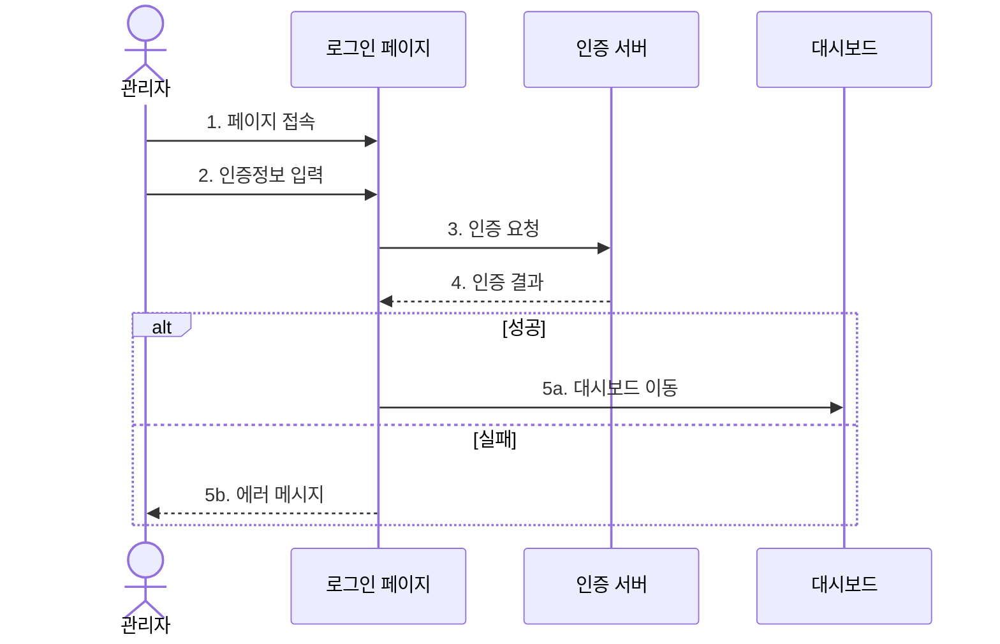

#### ✅ 선행 조건
| 조건 | 설명 |
|------|------|
| 계정 등록 | 관리자 계정이 시스템에 등록되어 있어야 함 |
| 쿠키 설정 | 브라우저의 쿠키 사용이 가능해야 함 |
| 네트워크 | 인터넷 연결이 가능해야 함 |

#### 🔄 정상 흐름
1. **페이지 접속**
   - URL을 통한 로그인 페이지 접근
   - 세션 만료 시 자동 리다이렉트

2. **인증 정보 입력**
   - 아이디 입력 (이메일 형식)
   - 비밀번호 입력 (8자 이상)
   - 자동 로그인 옵션 선택

3. **인증 처리**
   - 입력값 유효성 검증
   - 서버 측 인증 처리
   - JWT 토큰 발급

4. **세션 생성**
   - 사용자 세션 생성
   - 권한 정보 로드
   - 접근 토큰 저장

5. **리다이렉트**
   - 대시보드로 자동 이동
   - 환영 메시지 표시
   - 최근 알림 로드

#### 🔄 대안 흐름

##### 1️⃣ 잘못된 인증 정보
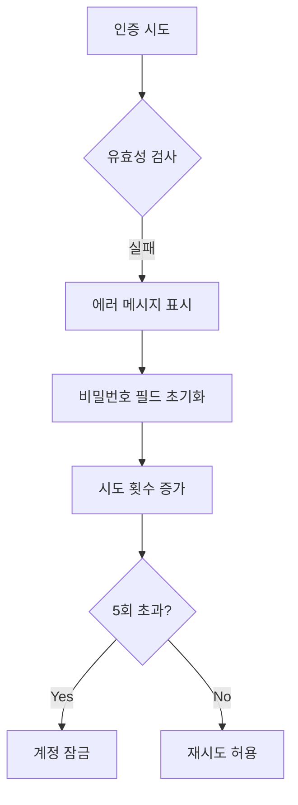

##### 2️⃣ 세션 만료
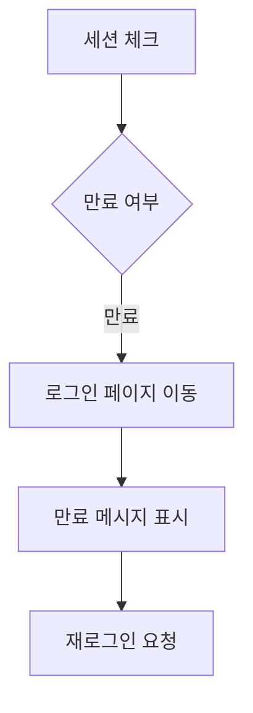

##### 3️⃣ 계정 잠금
| 상황 | 조치 사항 |
|------|-----------|
| 5회 실패 | - 계정 일시 잠금 (30분)<br>- 관리자 알림 발송<br>- 로그 기록 |
| 비밀번호 초기화 요청 | - 이메일 인증<br>- 임시 비밀번호 발급<br>- 최초 로그인 시 변경 강제 |

#### 🧪 테스트 케이스
| ID | 시나리오 | 입력 | 기대 결과 | 우선순위 |
|----|----------|------|------------|----------|
| TC-AUTH-001-1 | 정상 로그인 | ID: admin@cku.ac.kr<br>PW: admin123! | - 로그인 성공<br>- 대시보드 이동<br>- 환영 메시지 | 높음 |
| TC-AUTH-001-2 | 잘못된 비밀번호 | ID: admin@cku.ac.kr<br>PW: wrong123! | - 인증 실패<br>- 에러 메시지<br>- 시도 횟수 증가 | 높음 |
| TC-AUTH-001-3 | 존재하지 않는 계정 | ID: invalid@cku.ac.kr<br>PW: test123! | - 인증 실패<br>- 에러 메시지 | 중간 |
| TC-AUTH-001-4 | 빈 값 제출 | ID: ""<br>PW: "" | - 유효성 검사 실패<br>- 필수 입력 안내 | 중간 |
| TC-AUTH-001-5 | 계정 잠금 | 5회 연속 실패 | - 계정 잠금<br>- 관리자 문의 안내 | 높음 |

#### 🎨 UI 프로토타입
```
+------------------+
|    로그인        |
+------------------+
| 이메일           |
| [            ]   |
|                  |
| 비밀번호         |
| [            ]   |
|                  |
| [ ] 자동 로그인  |
|                  |
| [  로그인    ]   |
|                  |
| 비밀번호 찾기    |
+------------------+
```

### 1.2 로그아웃 (AUTH-002)

#### 📝 개요
관리자가 시스템에서 안전하게 로그아웃하는 기능을 제공합니다.

#### ⚡ 기능 흐름도
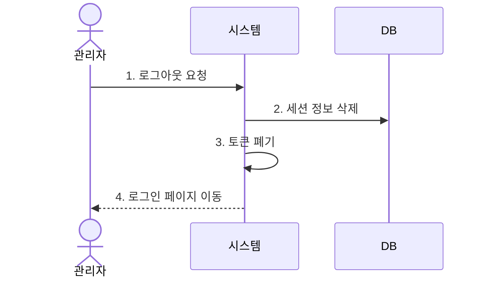

#### ✅ 선행 조건
| 조건 | 설명 |
|------|------|
| 로그인 상태 | 사용자가 로그인되어 있어야 함 |
| 유효 세션 | 세션이 만료되지 않은 상태여야 함 |

#### 🔄 정상 흐름
1. **로그아웃 요청**
   - 로그아웃 버튼 클릭
   - API 요청 전송

2. **세션 종료**
   - 서버 세션 삭제
   - 클라이언트 토큰 제거
   - 캐시 데이터 정리

3. **페이지 이동**
   - 로그인 페이지 리다이렉트
   - 로그아웃 완료 메시지

#### 🧪 테스트 케이스
| ID | 시나리오 | 동작 | 기대 결과 | 우선순위 |
|----|----------|------|------------|----------|
| TC-AUTH-002-1 | 정상 로그아웃 | 로그아웃 버튼 클릭 | - 세션 종료<br>- 로그인 페이지 이동<br>- 완료 메시지 | 높음 |
| TC-AUTH-002-2 | 세션 만료 후 로그아웃 | 만료된 세션에서 로그아웃 | - 로그인 페이지 이동<br>- 세션 만료 메시지 | 중간 |

## 👥 2. 학생 관리

### 2.1 학생 등록 (STU-001)

#### 📝 개요
새로운 학생 정보를 시스템에 등록하고 관리하는 기능을 제공합니다.

#### ⚡ 기능 흐름도
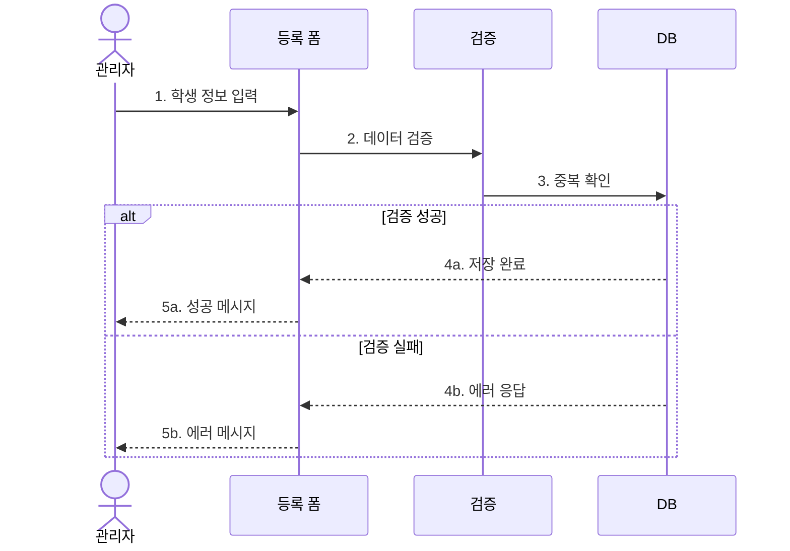

#### ✅ 선행 조건
| 조건 | 설명 |
|------|------|
| 권한 확인 | 학생 등록 권한이 있어야 함 |
| 필수 정보 | 기본 학생 정보가 준비되어 있어야 함 |
| 호실 여유 | 배정 가능한 호실이 있어야 함 |

#### 🔄 정상 흐름
1. **정보 입력**
   - 기본 정보
     * 이름
     * 학번
     * 학과
     * 학년
   - 연락처 정보
     * 전화번호
     * 이메일
     * 비상연락처
   - 기숙사 정보
     * 배정 호실
     * 입사 일자
     * 퇴사 예정일

2. **정보 검증**
   - 필수 항목 확인
   - 형식 검증
   - 중복 확인

3. **데이터 저장**
   - DB 저장
   - 인덱스 갱신
   - 로그 기록

4. **완료 처리**
   - 성공 메시지
   - 목록 갱신
   - 상세 페이지 이동

#### 🔄 대안 흐름

##### 1️⃣ 중복 학번
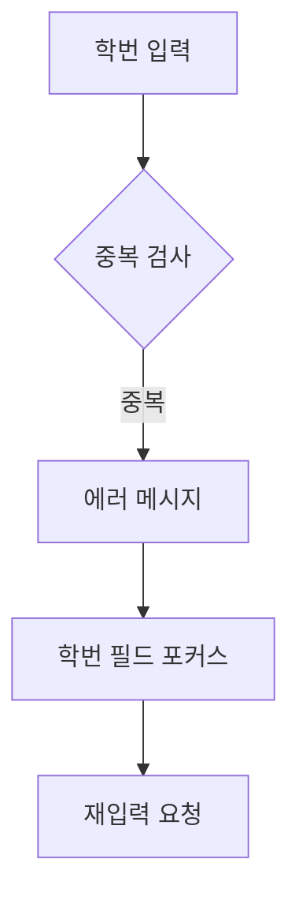

##### 2️⃣ 필수 정보 누락
| 필드 | 검증 규칙 | 에러 메시지 |
|------|-----------|-------------|
| 이름 | 2자 이상 | "이름을 입력해주세요" |
| 학번 | 8자리 숫자 | "올바른 학번을 입력해주세요" |
| 연락처 | 전화번호 형식 | "올바른 연락처를 입력해주세요" |
| 호실 | 필수 선택 | "호실을 선택해주세요" |

##### 3️⃣ 잘못된 형식
| 필드 | 형식 | 예시 |
|------|------|------|
| 이메일 | email | student@cku.ac.kr |
| 전화번호 | phone | 010-1234-5678 |
| 학번 | number | 20240001 |
| 생년월일 | date | 2000-01-01 |

#### 🧪 테스트 케이스
| ID | 시나리오 | 입력 | 기대 결과 | 우선순위 |
|----|----------|------|------------|----------|
| TC-STU-001-1 | 정상 등록 | 모든 필수 정보 입력 | - 등록 성공<br>- 목록 갱신<br>- 성공 메시지 | 높음 |
| TC-STU-001-2 | 중복 학번 | 기존 학번 입력 | - 등록 실패<br>- 중복 메시지<br>- 학번 포커스 | 높음 |
| TC-STU-001-3 | 필수 정보 누락 | 일부 정보만 입력 | - 등록 실패<br>- 필수 입력 안내 | 중간 |
| TC-STU-001-4 | 잘못된 전화번호 | "010-123-4567" | - 형식 오류<br>- 재입력 요청 | 중간 |
| TC-STU-001-5 | 잘못된 이메일 | "invalid.email" | - 형식 오류<br>- 재입력 요청 | 중간 |

#### 🎨 UI 프로토타입
```
+------------------------+
|    학생 등록           |
+------------------------+
| 기본 정보             |
| 이름 [          ]     |
| 학번 [          ]     |
| 학과 [          ]     |
| 학년 [          ]     |
|                       |
| 연락처 정보           |
| 전화 [          ]     |
| 이메일[          ]     |
| 비상 [          ]     |
|                       |
| 기숙사 정보           |
| 호실 [          ]     |
| 입사 [          ]     |
| 퇴사 [          ]     |
|                       |
| [  저장  ] [  취소  ] |
+------------------------+
```


# 📝 공지사항 관리 기능명세서

## 1. 공지사항 등록 (NOT-001)

### 📝 개요
관리자가 공지사항을 등록하고 관리하는 기능을 제공합니다.

### ⚡ 기능 흐름도
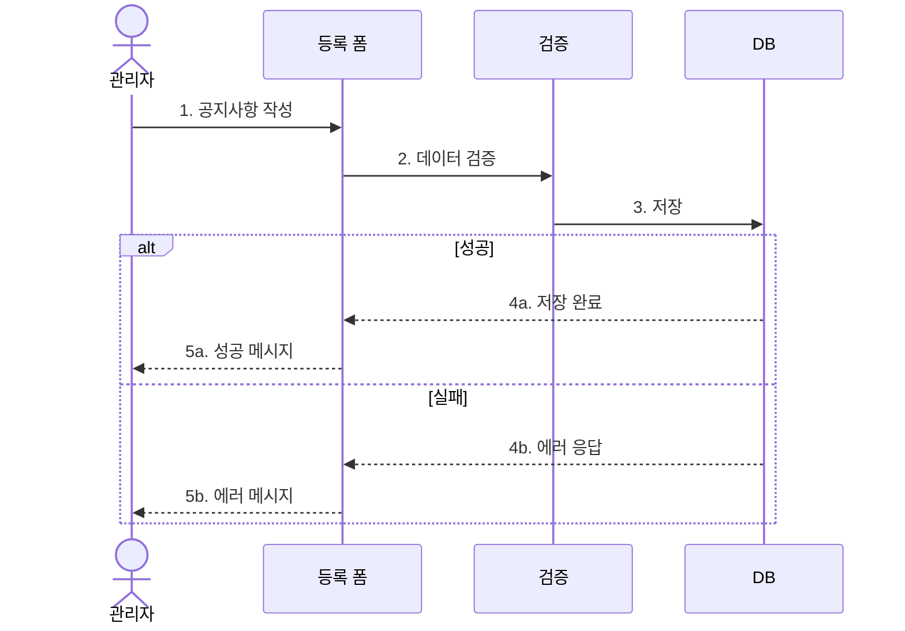

### ✅ 선행 조건
| 조건 | 설명 |
|------|------|
| 권한 확인 | 공지사항 등록 권한이 있어야 함 |
| 필수 정보 | 제목, 내용, 카테고리가 준비되어 있어야 함 |

### 🔄 정상 흐름
1. **정보 입력**
   - 기본 정보
     * 제목
     * 내용
     * 카테고리
   - 부가 정보
     * 중요도
     * 게시 기간
     * 첨부파일

2. **정보 검증**
   - 필수 항목 확인
   - 형식 검증
   - 파일 크기 검증

3. **데이터 저장**
   - DB 저장
   - 파일 업로드
   - 로그 기록

4. **완료 처리**
   - 성공 메시지
   - 목록 갱신
   - 상세 페이지 이동

### 🔄 대안 흐름

#### 1️⃣ 임시 저장
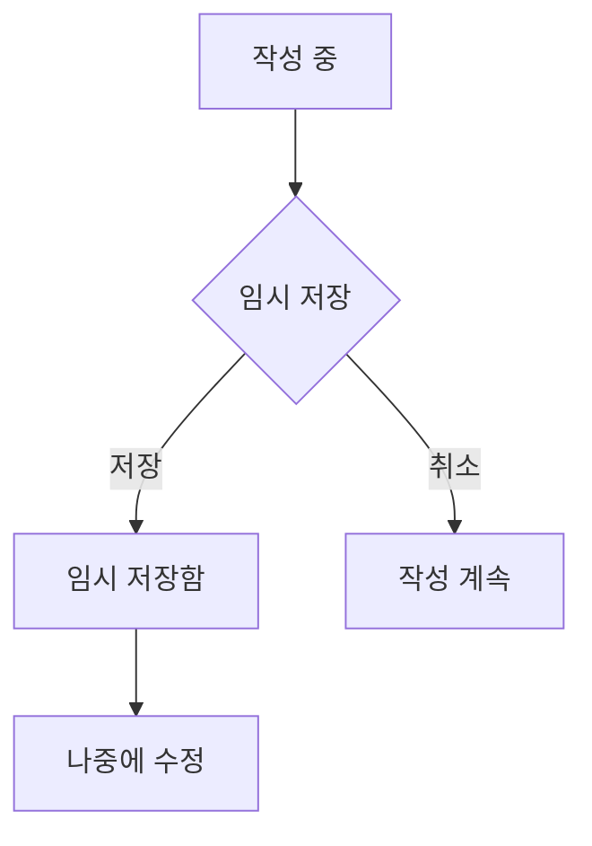

#### 2️⃣ 필수 정보 누락
| 필드 | 검증 규칙 | 에러 메시지 |
|------|-----------|-------------|
| 제목 | 2자 이상 | "제목을 입력해주세요" |
| 내용 | 10자 이상 | "내용을 입력해주세요" |
| 카테고리 | 필수 선택 | "카테고리를 선택해주세요" |

### 🧪 테스트 케이스
| ID | 시나리오 | 입력 | 기대 결과 | 우선순위 |
|----|----------|------|------------|----------|
| TC-NOT-001-1 | 정상 등록 | 모든 필수 정보 입력 | - 등록 성공<br>- 목록 갱신<br>- 성공 메시지 | 높음 |
| TC-NOT-001-2 | 필수 정보 누락 | 일부 정보만 입력 | - 등록 실패<br>- 필수 입력 안내 | 높음 |
| TC-NOT-001-3 | 대용량 첨부파일 | 100MB 파일 | - 크기 제한 안내<br>- 파일 선택 초기화 | 중간 |

### 🎨 UI 프로토타입
```
+------------------------+
|    공지사항 등록        |
+------------------------+
| 제목 [          ]     |
| 카테고리 [선택    ▼]   |
| 중요도   [선택    ▼]   |
|                       |
| 내용                  |
| [                    |
|                      |
|                    ] |
|                       |
| 첨부파일              |
| [  파일 선택  ]       |
|                       |
| [임시저장] [등록하기]  |
+------------------------+
```

## 2. 공지사항 수정 (NOT-002)

### 📝 개요
등록된 공지사항의 내용을 수정하는 기능을 제공합니다.

### ⚡ 기능 흐름도
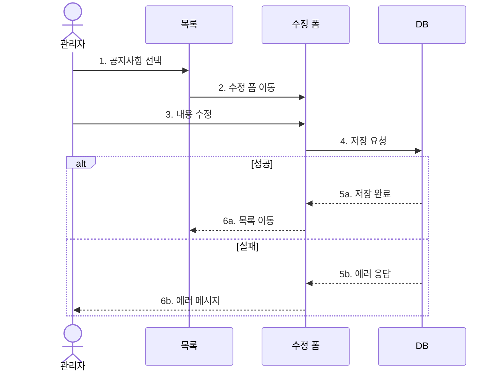

### ✅ 선행 조건
| 조건 | 설명 |
|------|------|
| 권한 확인 | 공지사항 수정 권한이 있어야 함 |
| 게시 상태 | 임시저장 또는 게시 상태여야 함 |

### 🔄 정상 흐름
1. **공지사항 선택**
   - 목록에서 선택
   - 상세 페이지에서 수정 버튼 클릭

2. **기존 정보 로드**
   - 제목, 내용 표시
   - 카테고리, 중요도 설정
   - 첨부파일 목록 표시

3. **정보 수정**
   - 내용 수정
   - 첨부파일 추가/삭제
   - 카테고리 변경

4. **저장 처리**
   - 변경사항 검증
   - DB 업데이트
   - 파일 처리

### 🧪 테스트 케이스
| ID | 시나리오 | 입력 | 기대 결과 | 우선순위 |
|----|----------|------|------------|----------|
| TC-NOT-002-1 | 정상 수정 | 일부 내용 수정 | - 수정 성공<br>- 목록 갱신 | 높음 |
| TC-NOT-002-2 | 첨부파일 추가 | 새 파일 추가 | - 파일 업로드<br>- 목록 갱신 | 중간 |
| TC-NOT-002-3 | 카테고리 변경 | 카테고리 수정 | - 변경 사항 저장<br>- 분류 갱신 | 중간 |

### 🎨 UI 프로토타입
```
+------------------------+
|    공지사항 수정        |
+------------------------+
| 제목 [기존 제목     ]  |
| 카테고리 [기존 값   ▼] |
| 중요도   [기존 값   ▼] |
|                       |
| 내용                  |
| [기존 내용           |
|                      |
|                    ] |
|                       |
| 첨부파일              |
| - 기존파일1.pdf [삭제] |
| - 기존파일2.jpg [삭제] |
| [  파일 추가  ]       |
|                       |
| [취소] [수정완료]     |
+------------------------+
``` 


# 👥 입주생 관리 기능명세서

## 1. 입주생 등록 (STU-001)

### 📝 개요
신규 입주생을 등록하고 호실을 배정하는 기능을 제공합니다.

### ⚡ 기능 흐름도
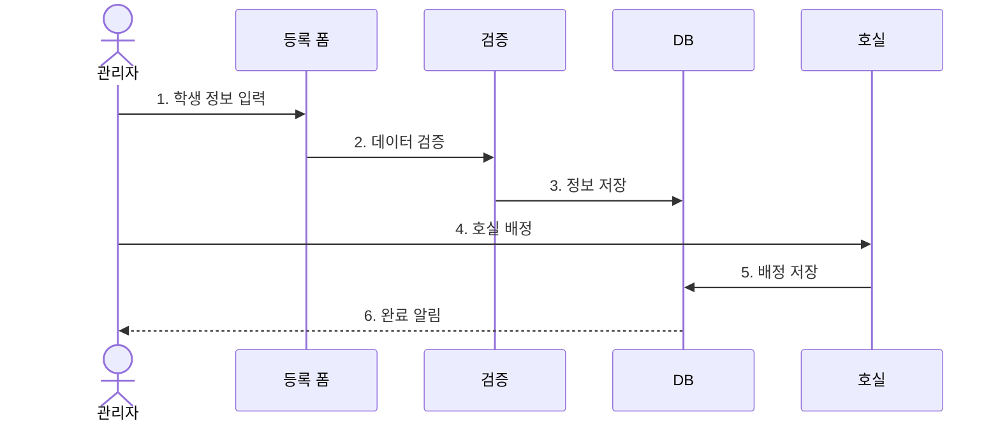

### ✅ 선행 조건
| 조건 | 설명 |
|------|------|
| 권한 확인 | 입주생 등록 권한이 있어야 함 |
| 호실 여유 | 배정 가능한 호실이 있어야 함 |
| 학생 자격 | 입주 자격 요건을 충족해야 함 |

### 🔄 정상 흐름
1. **기본 정보 입력**
   - 개인 정보
     * 이름
     * 학번
     * 학과/학년
     * 연락처
   - 보호자 정보
     * 성명
     * 관계
     * 연락처
   - 입주 정보
     * 입주 기간
     * 식사 여부
     * 특이사항

2. **서류 확인**
   - 필수 서류 업로드
   - 서류 검증
   - 승인 처리

3. **호실 배정**
   - 건물/층 선택
   - 호실 선택
   - 침대 번호 지정

4. **입주 처리**
   - 비품 체크리스트
   - 출입카드 발급
   - 오리엔테이션 일정

### 🔄 대안 흐름

#### 1️⃣ 우선순위 배정
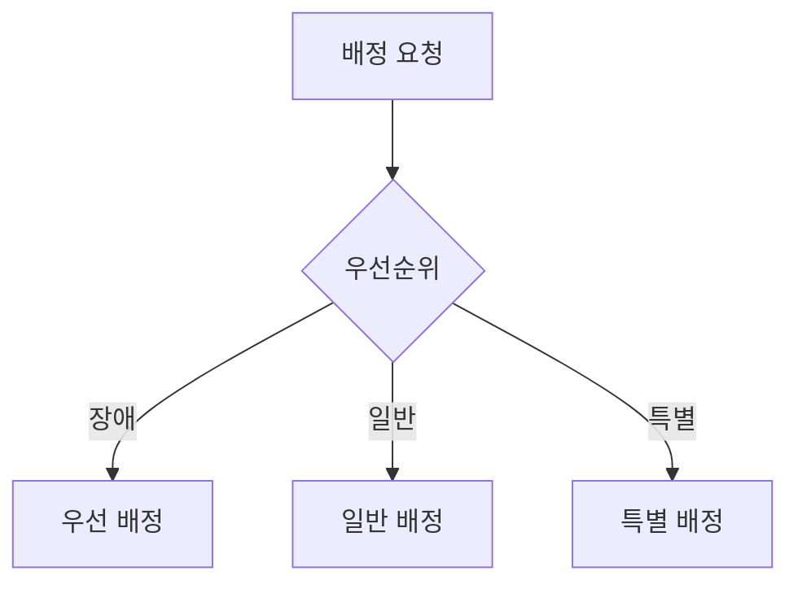

#### 2️⃣ 입주 연기/취소
| 상황 | 처리 방법 |
|------|-----------|
| 입주 연기 | - 사유 확인<br>- 기간 조정<br>- 호실 유지 |
| 입주 취소 | - 서류 접수<br>- 호실 반납<br>- 대기자 배정 |

### 🧪 테스트 케이스
| ID | 시나리오 | 입력 | 기대 결과 | 우선순위 |
|----|----------|------|------------|----------|
| TC-STU-001-1 | 정상 등록 | 모든 정보 입력 | - 등록 완료<br>- 호실 배정 | 높음 |
| TC-STU-001-2 | 서류 미비 | 서류 누락 | - 등록 보류<br>- 서류 요청 | 높음 |
| TC-STU-001-3 | 호실 부족 | 만실 상태 | - 대기 등록<br>- 순번 부여 | 중간 |

### 🎨 UI 프로토타입
```
+------------------------+
|    입주생 등록         |
+------------------------+
| 기본 정보             |
| 이름 [          ]     |
| 학번 [          ]     |
| 학과 [          ]     |
| 학년 [          ]     |
| 연락처[          ]    |
|                       |
| 보호자 정보           |
| 성명 [          ]     |
| 관계 [          ]     |
| 연락처[          ]    |
|                       |
| 입주 정보             |
| 기간 [          ]     |
| 식사 [ ] 신청        |
| 특이사항[          ]  |
|                       |
| 서류 제출             |
| [  파일 선택  ]       |
|                       |
| 호실 배정             |
| 건물 [선택    ▼]     |
| 호실 [선택    ▼]     |
| 침대 [선택    ▼]     |
|                       |
| [임시저장] [등록하기] |
+------------------------+
```

## 2. 상벌점 관리 (STU-002)

### 📝 개요
입주생의 상벌점을 등록하고 관리하는 기능을 제공합니다.

### ⚡ 기능 흐름도
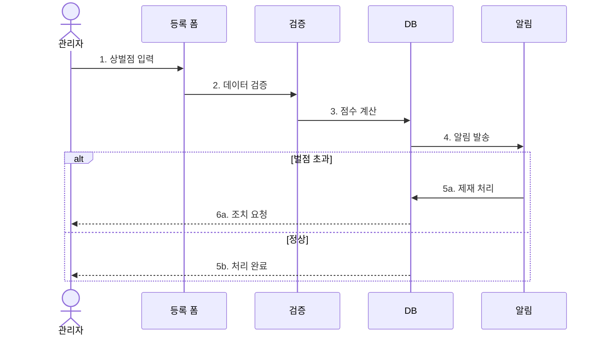

### ✅ 선행 조건
| 조건 | 설명 |
|------|------|
| 학생 상태 | 현재 입주중인 상태여야 함 |
| 권한 확인 | 상벌점 부여 권한이 있어야 함 |
| 규정 확인 | 상벌점 규정이 정의되어 있어야 함 |

### 🔄 정상 흐름
1. **상벌점 입력**
   - 기본 정보
     * 학생 선택
     * 일자 선택
     * 항목 선택
   - 상세 정보
     * 점수 입력
     * 사유 작성
     * 증빙 자료

2. **점수 처리**
   - 현재 점수 확인
   - 점수 계산
   - 누적 관리

3. **조치 사항**
   - 경고 발송
   - 제재 처리
   - 이의 신청

4. **이력 관리**
   - 기록 저장
   - 통계 분석
   - 보고서 생성

### 🔄 대안 흐름

#### 1️⃣ 이의 신청
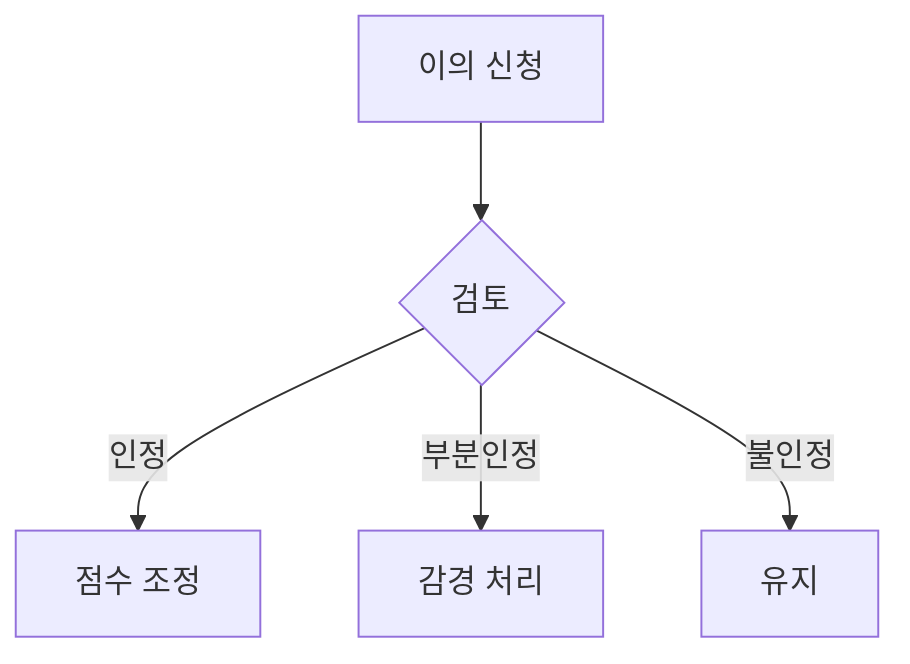

#### 2️⃣ 제재 처리
| 벌점 | 조치 사항 |
|------|-----------|
| 10점 이상 | - 경고장 발송<br>- 보호자 통보<br>- 면담 진행 |
| 20점 이상 | - 퇴사 처리<br>- 재입주 제한<br>- 환불 처리 |

### 🧪 테스트 케이스
| ID | 시나리오 | 입력 | 기대 결과 | 우선순위 |
|----|----------|------|------------|----------|
| TC-STU-002-1 | 상점 부여 | 봉사활동 5점 | - 점수 반영<br>- 이력 저장 | 중간 |
| TC-STU-002-2 | 벌점 부여 | 소음 3점 | - 점수 반영<br>- 알림 발송 | 높음 |
| TC-STU-002-3 | 벌점 초과 | 누적 20점 | - 퇴사 처리<br>- 통보 발송 | 높음 |

### 🎨 UI 프로토타입
```
+------------------------+
|    상벌점 관리         |
+------------------------+
| 학생 검색             |
| [          ]          |
|                       |
| 점수 입력             |
| 구분 [상점/벌점  ▼]   |
| 항목 [선택      ▼]    |
| 점수 [          ]     |
|                       |
| 상세 사유             |
| [                    |
|                    ] |
|                       |
| 증빙 자료             |
| [  파일 선택  ]       |
|                       |
| 처리 결과             |
| 현재 점수: 8점        |
| 누적 상점: 10점       |
| 누적 벌점: 2점        |
|                       |
| [저장] [이력조회]     |
+------------------------+
``` 


# 🏠 호실 관리 기능명세서

## 1. 호실 변경 (ROOM-001)

### 📝 개요
입주생의 호실 변경 요청을 처리하고 관리하는 기능을 제공합니다.

### ⚡ 기능 흐름도


### ✅ 선행 조건
| 조건 | 설명 |
|------|------|
| 학생 상태 | 정상 입주 상태여야 함 |
| 벌점 상태 | 제한 벌점이 없어야 함 |
| 호실 상태 | 변경 가능한 호실이 있어야 함 |

### 🔄 정상 흐름
1. **변경 신청**
   - 기본 정보
     * 현재 호실
     * 희망 호실
     * 변경 사유
   - 추가 정보
     * 희망 일자
     * 룸메이트 정보
     * 특이사항

2. **자격 검증**
   - 거주 기간 확인
   - 벌점 확인
   - 납부 상태 확인

3. **호실 확인**
   - 희망 호실 상태
   - 수용 가능 여부
   - 대기 순위

4. **변경 처리**
   - 이동 일정 조정
   - 비품 점검
   - 카드키 재발급

### 🔄 대안 흐름

#### 1️⃣ 긴급 변경
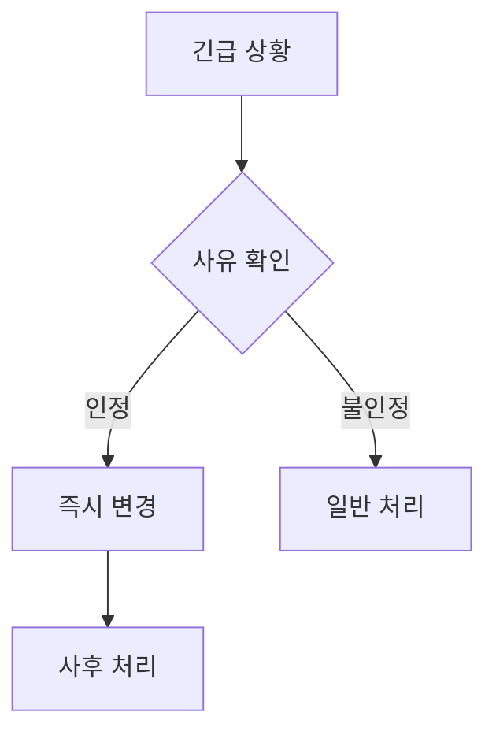

#### 2️⃣ 호실 교환
| 상황 | 처리 방법 |
|------|-----------|
| 상호 교환 | - 양측 동의<br>- 일괄 처리<br>- 동시 이동 |
| 순환 교환 | - 3인 이상<br>- 순서 조정<br>- 일정 조율 |

### 🧪 테스트 케이스
| ID | 시나리오 | 입력 | 기대 결과 | 우선순위 |
|----|----------|------|------------|----------|
| TC-ROOM-001-1 | 정상 신청 | 모든 정보 입력 | - 신청 완료<br>- 승인 대기 | 높음 |
| TC-ROOM-001-2 | 자격 미달 | 벌점 초과 | - 신청 거절<br>- 사유 안내 | 높음 |
| TC-ROOM-001-3 | 호실 불가 | 만실 상태 | - 대기 등록<br>- 순번 부여 | 중간 |

### 🎨 UI 프로토타입
```
+------------------------+
|    호실 변경 신청      |
+------------------------+
| 현재 호실             |
| 건물 [표시]           |
| 호실 [표시]           |
| 침대 [표시]           |
|                       |
| 희망 호실             |
| 건물 [선택    ▼]     |
| 호실 [선택    ▼]     |
| 침대 [선택    ▼]     |
|                       |
| 변경 사유             |
| [선택하세요     ▼]    |
| 상세 사유             |
| [                    |
|                    ] |
|                       |
| 희망일 [          ]   |
|                       |
| [신청하기] [취소]     |
+------------------------+
```

## 2. 문의사항 관리 (QNA-001)

### 📝 개요
입주생의 문의사항을 접수하고 처리하는 기능을 제공합니다.

### ⚡ 기능 흐름도
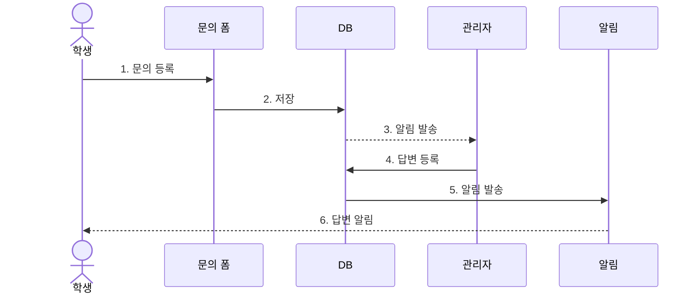

### ✅ 선행 조건
| 조건 | 설명 |
|------|------|
| 사용자 인증 | 로그인 상태여야 함 |
| 문의 유형 | 문의 유형이 정의되어 있어야 함 |
| 처리 담당자 | 유형별 담당자가 지정되어 있어야 함 |

### 🔄 정상 흐름
1. **문의 등록**
   - 기본 정보
     * 제목
     * 유형
     * 내용
   - 부가 정보
     * 첨부파일
     * 공개 여부
     * 알림 설정

2. **접수 처리**
   - 담당자 배정
   - 우선순위 지정
   - 처리 기한 설정

3. **답변 등록**
   - 답변 작성
   - 처리 상태 변경
   - 첨부파일 추가

4. **만족도 평가**
   - 답변 평가
   - 의견 작성
   - 재문의 여부

### 🔄 대안 흐름

#### 1️⃣ 답변 수정
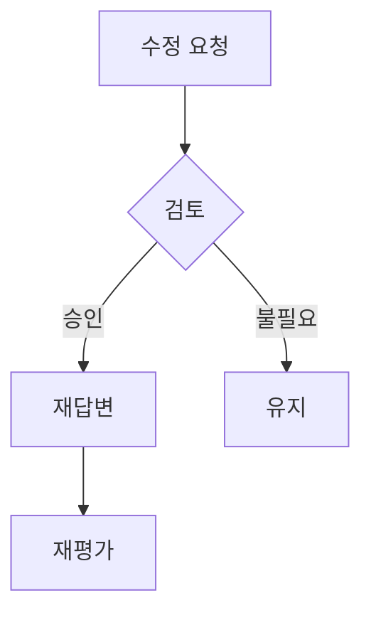

#### 2️⃣ 문의 이관
| 상황 | 처리 방법 |
|------|-----------|
| 부서 이관 | - 담당자 변경<br>- 인수인계<br>- 처리 기한 조정 |
| 외부 이관 | - 외부 기관 이관<br>- 진행상황 공유<br>- 결과 등록 |

### 🧪 테스트 케이스
| ID | 시나리오 | 입력 | 기대 결과 | 우선순위 |
|----|----------|------|------------|----------|
| TC-QNA-001-1 | 일반 문의 | 기본 정보 | - 접수 완료<br>- 알림 발송 | 높음 |
| TC-QNA-001-2 | 긴급 문의 | 긴급 표시 | - 우선 처리<br>- 담당자 통보 | 높음 |
| TC-QNA-001-3 | 재문의 | 추가 질문 | - 원문의 연결<br>- 이력 관리 | 중간 |

### 🎨 UI 프로토타입
```
+------------------------+
|    문의사항 등록       |
+------------------------+
| 제목 [          ]     |
|                       |
| 유형                  |
| [선택하세요     ▼]    |
|                       |
| 내용                  |
| [                    |
|                      |
|                    ] |
|                       |
| 첨부파일              |
| [  파일 선택  ]       |
|                       |
| 옵션                  |
| [ ] 비공개           |
| [ ] 알림 받기        |
| [ ] 긴급 문의        |
|                       |
| [등록하기] [취소]     |
+------------------------+
``` 


# 🌙 외박 관리 기능명세서

## 1. 외박 신청 (OVN-001)

### 📝 개요
학생이 외박을 신청하고 관리자가 이를 승인/거절하는 기능을 제공합니다.

### ⚡ 기능 흐름도
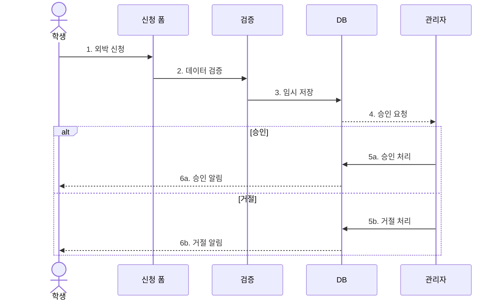

### ✅ 선행 조건
| 조건 | 설명 |
|------|------|
| 학생 상태 | 정상 재사 상태여야 함 |
| 벌점 상태 | 외박 제한 벌점이 없어야 함 |
| 신청 기한 | 외박 3일 전까지 신청 가능 |

### 🔄 정상 흐름
1. **신청 정보 입력**
   - 기본 정보
     * 외박 기간
     * 외박 사유
     * 목적지
   - 연락처 정보
     * 긴급 연락처
     * 보호자 연락처
   - 증빙 서류
     * 외박 증빙 서류
     * 보호자 동의서

2. **정보 검증**
   - 필수 항목 확인
   - 기간 유효성 검사
   - 서류 확인

3. **승인 처리**
   - 관리자 검토
   - 승인/거절 결정
   - 결과 통보

4. **이력 관리**
   - 신청 이력 저장
   - 통계 업데이트
   - 보고서 생성

### 🔄 대안 흐름

#### 1️⃣ 긴급 외박
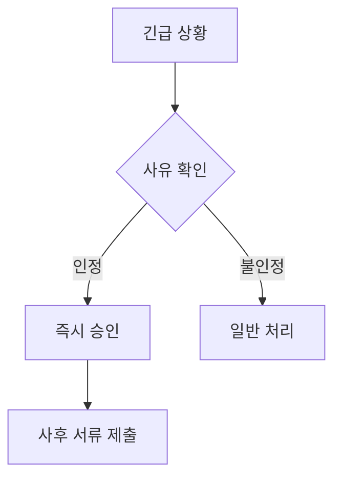

#### 2️⃣ 연장 신청
| 상황 | 처리 방법 |
|------|-----------|
| 당일 연장 | - 전화 승인 필요<br>- 사유서 제출<br>- 보호자 확인 |
| 사전 연장 | - 수정 신청<br>- 추가 서류 제출<br>- 재승인 필요 |

### 🧪 테스트 케이스
| ID | 시나리오 | 입력 | 기대 결과 | 우선순위 |
|----|----------|------|------------|----------|
| TC-OVN-001-1 | 정상 신청 | 모든 정보 정상 입력 | - 신청 완료<br>- 승인 대기 | 높음 |
| TC-OVN-001-2 | 서류 미비 | 서류 누락 | - 신청 실패<br>- 서류 보완 요청 | 높음 |
| TC-OVN-001-3 | 기간 초과 | 7일 이상 | - 신청 실패<br>- 기간 조정 요청 | 중간 |

### 🎨 UI 프로토타입
```
+------------------------+
|    외박 신청           |
+------------------------+
| 외박 기간             |
| 시작 [          ]     |
| 종료 [          ]     |
|                       |
| 외박 사유             |
| [선택하세요     ▼]    |
| 상세 사유             |
| [                    |
|                    ] |
|                       |
| 목적지               |
| 주소 [          ]    |
| 상세 [          ]    |
|                       |
| 연락처               |
| 본인 [          ]    |
| 보호자[          ]    |
|                       |
| 증빙 서류             |
| [  파일 선택  ]       |
|                       |
| [임시저장] [신청하기] |
+------------------------+
```

## 2. 외박 현황 관리 (OVN-002)

### 📝 개요
관리자가 외박 신청 현황을 관리하고 통계를 확인하는 기능을 제공합니다.

### ⚡ 기능 흐름도
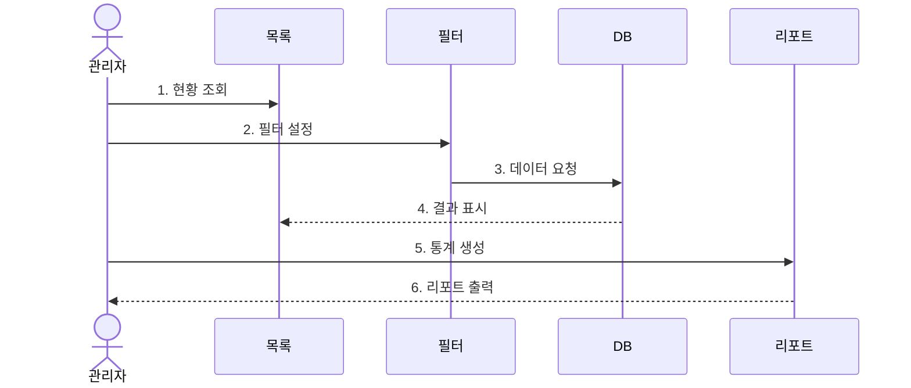

### ✅ 선행 조건
| 조건 | 설명 |
|------|------|
| 권한 확인 | 외박 관리 권한이 있어야 함 |
| 데이터 범위 | 조회 기간이 설정되어 있어야 함 |

### 🔄 정상 흐름
1. **현황 조회**
   - 전체 신청 현황
   - 승인 대기 목록
   - 처리 완료 목록

2. **필터 적용**
   - 기간별 조회
   - 상태별 조회
   - 학생별 조회

3. **통계 확인**
   - 기간별 통계
   - 사유별 통계
   - 학과별 통계

4. **리포트 생성**
   - 일일 보고서
   - 주간 보고서
   - 월간 보고서

### 🧪 테스트 케이스
| ID | 시나리오 | 입력 | 기대 결과 | 우선순위 |
|----|----------|------|------------|----------|
| TC-OVN-002-1 | 전체 조회 | 기본 필터 | - 전체 목록 표시<br>- 페이지네이션 | 높음 |
| TC-OVN-002-2 | 기간 필터 | 특정 기간 선택 | - 필터링된 목록<br>- 통계 갱신 | 중간 |
| TC-OVN-002-3 | 리포트 생성 | 월간 리포트 | - PDF 생성<br>- 통계 포함 | 중간 |

### 🎨 UI 프로토타입
```
+------------------------+
|    외박 현황           |
+------------------------+
| 기간 [시작일] [종료일] |
| 상태 [전체    ▼]      |
| 검색 [          ]     |
|                       |
| 전체: 100건           |
| 승인대기: 10건        |
| 승인완료: 85건        |
| 거절: 5건             |
|                       |
| [목록]                |
| 1. 홍길동 3/1~3/3    |
|    - 가정방문        |
|    [승인] [거절]     |
| 2. 김철수 3/2~3/4    |
|    - 병원진료        |
|    [승인완료]        |
|                       |
| [리포트 생성]         |
+------------------------+
``` 


# 🍽 식단 관리 기능명세서

## 1. 식단 등록 (MEAL-001)

### 📝 개요
관리자가 주간/월간 식단을 등록하고 관리하는 기능을 제공합니다.

### ⚡ 기능 흐름도
```mermaid
sequenceDiagram
    actor A as 관리자
    participant F as 등록 폼
    participant V as 검증
    participant D as DB
    participant N as 알림
    
    A->>F: 1. 식단 입력
    F->>V: 2. 데이터 검증
    V->>D: 3. 저장
    D->>N: 4. 알림 발송
    alt 성공
        N-->>A: 5a. 완료 알림
    else 실패
        N-->>A: 5b. 에러 알림
    end
```

### ✅ 선행 조건
| 조건 | 설명 |
|------|------|
| 권한 확인 | 식단 관리 권한이 있어야 함 |
| 기간 설정 | 등록할 기간이 지정되어 있어야 함 |
| 메뉴 정보 | 기본 메뉴 정보가 등록되어 있어야 함 |

### 🔄 정상 흐름
1. **기간 설정**
   - 등록 기간 선택
   - 식사 구분 선택
   - 특별 식단 여부

2. **메뉴 입력**
   - 메인 메뉴
   - 서브 메뉴
   - 영양 정보

3. **옵션 설정**
   - 알레르기 정보
   - 칼로리 정보
   - 가격 정보

4. **공지 설정**
   - 변경 사항
   - 특이 사항
   - 공지 범위

### 🔄 대안 흐름

#### 1️⃣ 특별 식단
```mermaid
graph TD
    A[특별 식단] --> B{종류 선택}
    B -->|행사| C[행사 식단]
    B -->|계절| D[계절 식단]
    B -->|기념일| E[기념일 식단]
```

#### 2️⃣ 메뉴 변경
| 상황 | 처리 방법 |
|------|-----------|
| 당일 변경 | - 긴급 변경<br>- 알림 발송<br>- 사유 등록 |
| 사전 변경 | - 수정 등록<br>- 공지 등록<br>- 이력 관리 |

### 🧪 테스트 케이스
| ID | 시나리오 | 입력 | 기대 결과 | 우선순위 |
|----|----------|------|------------|----------|
| TC-MEAL-001-1 | 정상 등록 | 주간 식단 | - 등록 완료<br>- 알림 발송 | 높음 |
| TC-MEAL-001-2 | 특별 식단 | 행사 식단 | - 등록 완료<br>- 특별 표시 | 중간 |
| TC-MEAL-001-3 | 중복 등록 | 기존 기간 | - 중복 경고<br>- 수정 확인 | 중간 |

### 🎨 UI 프로토타입
```
+------------------------+
|    식단 등록           |
+------------------------+
| 기간 설정             |
| 시작 [          ]     |
| 종료 [          ]     |
|                       |
| 식사 구분             |
| [ ] 아침              |
| [ ] 점심              |
| [ ] 저녁              |
|                       |
| 메뉴 입력             |
| 메인 [          ]     |
| 서브1[          ]     |
| 서브2[          ]     |
| 국   [          ]     |
|                       |
| 영양 정보             |
| 칼로리[          ]    |
| 알러지[          ]    |
| 가격 [          ]     |
|                       |
| [임시저장] [등록하기] |
+------------------------+
```

## 2. 식단 조회 (MEAL-002)

### 📝 개요
학생과 관리자가 등록된 식단을 조회하는 기능을 제공합니다.

### ⚡ 기능 흐름도
```mermaid
sequenceDiagram
    actor U as 사용자
    participant L as 목록
    participant F as 필터
    participant D as DB
    participant E as 평가
    
    U->>L: 1. 식단 조회
    U->>F: 2. 필터 설정
    F->>D: 3. 데이터 요청
    D-->>L: 4. 결과 표시
    U->>E: 5. 평가 입력
    E->>D: 6. 평가 저장
```

### ✅ 선행 조건
| 조건 | 설명 |
|------|------|
| 식단 등록 | 해당 기간의 식단이 등록되어 있어야 함 |
| 조회 권한 | 식단 조회 권한이 있어야 함 |

### 🔄 정상 흐름
1. **조회 설정**
   - 기간 선택
   - 식사 구분
   - 메뉴 검색

2. **상세 정보**
   - 메뉴 구성
   - 영양 정보
   - 알레르기 정보

3. **평가 기능**
   - 만족도 평가
   - 의견 작성
   - 선호도 통계

4. **통계 확인**
   - 인기 메뉴
   - 만족도 추이
   - 개선 요구사항

### 🧪 테스트 케이스
| ID | 시나리오 | 입력 | 기대 결과 | 우선순위 |
|----|----------|------|------------|----------|
| TC-MEAL-002-1 | 일간 조회 | 특정 일자 | - 식단 표시<br>- 상세 정보 | 높음 |
| TC-MEAL-002-2 | 주간 조회 | 특정 주 | - 주간 식단<br>- 요약 정보 | 중간 |
| TC-MEAL-002-3 | 평가 입력 | 만족도 평가 | - 평가 저장<br>- 통계 반영 | 중간 |

### 🎨 UI 프로토타입
```
+------------------------+
|    식단 조회           |
+------------------------+
| 조회 기간             |
| [오늘] [이번주] [월간] |
| [          ] ~       |
| [          ]         |
|                       |
| 2024-03-15 (금)      |
| 아침                  |
| - 흰밥                |
| - 미역국              |
| - 계란말이            |
| - 김치                |
| 점심                  |
| - 잡곡밥              |
| - 된장찌개            |
| - 불고기              |
| - 반찬 3종            |
| 저녁                  |
| - 비빔밥              |
| - 유부국              |
| - 반찬 4종            |
|                       |
| 만족도: ★★★★☆        |
| [평가하기] [통계보기] |
+------------------------+
``` 


# 🏥 시설 관리 기능명세서

## 1. 수리 요청 (FAC-001)

### 📝 개요
학생이나 관리자가 시설 수리를 요청하고 처리하는 기능을 제공합니다.

### ⚡ 기능 흐름도
```mermaid
sequenceDiagram
    actor U as 사용자
    participant F as 요청 폼
    participant V as 검증
    participant D as DB
    participant M as 관리자
    
    U->>F: 1. 수리 요청
    F->>V: 2. 데이터 검증
    V->>D: 3. 요청 저장
    D-->>M: 4. 알림 발송
    alt 승인
        M->>D: 5a. 작업 지시
        D-->>U: 6a. 처리 알림
    else 반려
        M->>D: 5b. 반려 처리
        D-->>U: 6b. 반려 알림
    end
```

### ✅ 선행 조건
| 조건 | 설명 |
|------|------|
| 시설 정보 | 해당 시설이 등록되어 있어야 함 |
| 사용자 권한 | 수리 요청 권한이 있어야 함 |
| 위치 정보 | 정확한 위치 정보가 있어야 함 |

### 🔄 정상 흐름
1. **요청 정보 입력**
   - 기본 정보
     * 시설 종류
     * 위치 정보
     * 문제 상황
   - 상세 정보
     * 문제 설명
     * 사진 첨부
     * 긴급도

2. **요청 검증**
   - 필수 항목 확인
   - 위치 확인
   - 중복 요청 확인

3. **처리 계획**
   - 우선순위 지정
   - 작업자 배정
   - 일정 수립

4. **작업 관리**
   - 진행상황 기록
   - 자재 관리
   - 완료 보고

### 🔄 대안 흐름

#### 1️⃣ 긴급 수리
```mermaid
graph TD
    A[긴급 상황] --> B{위험도 평가}
    B -->|높음| C[즉시 처리]
    B -->|보통| D[우선 처리]
    B -->|낮음| E[일반 처리]
```

#### 2️⃣ 외부 업체 의뢰
| 상황 | 처리 방법 |
|------|-----------|
| 전문 공사 | - 업체 선정<br>- 견적 요청<br>- 작업 의뢰 |
| 부품 교체 | - 부품 확인<br>- 구매 요청<br>- 교체 작업 |

### 🧪 테스트 케이스
| ID | 시나리오 | 입력 | 기대 결과 | 우선순위 |
|----|----------|------|------------|----------|
| TC-FAC-001-1 | 정상 요청 | 모든 정보 입력 | - 요청 등록<br>- 알림 발송 | 높음 |
| TC-FAC-001-2 | 긴급 수리 | 긴급 표시 | - 우선 처리<br>- 담당자 배정 | 높음 |
| TC-FAC-001-3 | 중복 요청 | 기존 요청 있음 | - 중복 안내<br>- 진행상황 표시 | 중간 |

### 🎨 UI 프로토타입
```
+------------------------+
|    수리 요청           |
+------------------------+
| 시설 분류             |
| [선택하세요     ▼]    |
|                       |
| 위치 정보             |
| 건물 [          ]     |
| 층수 [          ]     |
| 호실 [          ]     |
|                       |
| 문제 상황             |
| [                    |
|                      |
|                    ] |
|                       |
| 긴급도               |
| [ ] 긴급 수리 필요    |
|                       |
| 사진 첨부             |
| [  파일 선택  ]       |
|                       |
| [임시저장] [요청하기] |
+------------------------+
```

## 2. 시설 점검 (FAC-002)

### 📝 개요
정기적인 시설 점검을 계획하고 실행하는 기능을 제공합니다.

### ⚡ 기능 흐름도
```mermaid
sequenceDiagram
    actor M as 관리자
    participant P as 계획
    participant C as 점검
    participant D as DB
    participant R as 보고서
    
    M->>P: 1. 점검 계획
    P->>D: 2. 일정 등록
    M->>C: 3. 점검 실시
    C->>D: 4. 결과 기록
    M->>R: 5. 보고서 생성
    R-->>M: 6. 결과 확인
```

### ✅ 선행 조건
| 조건 | 설명 |
|------|------|
| 점검 계획 | 연간/월간 점검 계획이 있어야 함 |
| 점검 항목 | 시설별 점검 항목이 정의되어 있어야 함 |
| 점검자 | 담당 점검자가 지정되어 있어야 함 |

### 🔄 정상 흐름
1. **계획 수립**
   - 점검 일정
   - 담당자 배정
   - 점검 항목

2. **점검 실시**
   - 현장 확인
   - 상태 기록
   - 문제 발견

3. **결과 처리**
   - 데이터 입력
   - 문제 분류
   - 조치 계획

4. **보고서 작성**
   - 결과 정리
   - 통계 작성
   - 개선 제안

### 🧪 테스트 케이스
| ID | 시나리오 | 입력 | 기대 결과 | 우선순위 |
|----|----------|------|------------|----------|
| TC-FAC-002-1 | 정기 점검 | 월간 계획 | - 일정 등록<br>- 담당자 통보 | 높음 |
| TC-FAC-002-2 | 점검 실시 | 점검 결과 | - 결과 저장<br>- 보고서 생성 | 높음 |
| TC-FAC-002-3 | 문제 발견 | 문제 상황 | - 수리 요청<br>- 조치 계획 | 중간 |

### 🎨 UI 프로토타입
```
+------------------------+
|    시설 점검           |
+------------------------+
| 점검 계획             |
| 일자 [          ]     |
| 구분 [정기/수시  ▼]   |
| 담당 [          ]     |
|                       |
| 점검 항목             |
| [ ] 전기 설비         |
| [ ] 소방 설비         |
| [ ] 위생 설비         |
| [ ] 구조물            |
|                       |
| 점검 결과             |
| 상태 [양호/불량  ▼]   |
| 의견 [          ]     |
| 사진 [  파일선택  ]   |
|                       |
| [저장] [보고서작성]   |
+------------------------+
``` 


# 👤 관리자 계정 관리 기능명세서

## 1. 계정 등록 (ADMIN-001)

### 📝 개요
새로운 관리자 계정을 등록하고 권한을 설정하는 기능을 제공합니다.

### ⚡ 기능 흐름도
```mermaid
sequenceDiagram
    actor A as 최고관리자
    participant F as 등록 폼
    participant V as 검증
    participant D as DB
    participant M as 메일
    
    A->>F: 1. 계정 정보 입력
    F->>V: 2. 데이터 검증
    V->>D: 3. 계정 생성
    D->>M: 4. 초기 정보 발송
    alt 성공
        M-->>A: 5a. 완료 알림
    else 실패
        M-->>A: 5b. 에러 알림
    end
```

### ✅ 선행 조건
| 조건 | 설명 |
|------|------|
| 권한 확인 | 계정 생성 권한이 있어야 함 |
| 역할 정의 | 부여할 역할이 정의되어 있어야 함 |
| 이메일 확인 | 유효한 이메일 주소여야 함 |

### 🔄 정상 흐름
1. **기본 정보 입력**
   - 계정 정보
     * 이름
     * 이메일
     * 연락처
   - 권한 정보
     * 역할 선택
     * 접근 권한
     * 관리 범위

2. **권한 설정**
   - 메뉴별 권한
   - 기능별 권한
   - 데이터 접근 범위

3. **계정 생성**
   - 임시 비밀번호 생성
   - 계정 활성화
   - 초기 설정 안내

4. **알림 발송**
   - 이메일 발송
   - SMS 발송
   - 접속 방법 안내

### 🔄 대안 흐름

#### 1️⃣ 권한 상속
```mermaid
graph TD
    A[권한 설정] --> B{역할 선택}
    B -->|사감| C[전체 권한]
    B -->|조교| D[제한 권한]
    B -->|시설| E[시설 권한]
```

#### 2️⃣ 계정 복사
| 상황 | 처리 방법 |
|------|-----------|
| 동일 역할 | - 기존 계정 복사<br>- 개인정보 변경<br>- 권한 확인 |
| 권한 조정 | - 기본 권한 복사<br>- 권한 추가/제거<br>- 설정 확인 |

### 🧪 테스트 케이스
| ID | 시나리오 | 입력 | 기대 결과 | 우선순위 |
|----|----------|------|------------|----------|
| TC-ADMIN-001-1 | 정상 등록 | 모든 정보 입력 | - 계정 생성<br>- 알림 발송 | 높음 |
| TC-ADMIN-001-2 | 중복 이메일 | 기존 이메일 | - 등록 실패<br>- 오류 안내 | 높음 |
| TC-ADMIN-001-3 | 권한 설정 | 역할 선택 | - 권한 부여<br>- 설정 완료 | 중간 |

### 🎨 UI 프로토타입
```
+------------------------+
|    관리자 등록         |
+------------------------+
| 기본 정보             |
| 이름 [          ]     |
| 이메일[          ]    |
| 연락처[          ]    |
|                       |
| 권한 설정             |
| 역할 [선택    ▼]     |
|                       |
| 접근 권한             |
| [ ] 학생 관리         |
| [ ] 시설 관리         |
| [ ] 식단 관리         |
| [ ] 공지사항          |
| [ ] 통계 조회         |
|                       |
| 관리 범위             |
| [ ] 전체              |
| [ ] 특정 건물         |
| 건물 [선택    ▼]     |
|                       |
| [임시저장] [등록하기] |
+------------------------+
```

## 2. 권한 관리 (ADMIN-002)

### 📝 개요
관리자 계정의 권한을 관리하고 이력을 추적하는 기능을 제공합니다.

### ⚡ 기능 흐름도
```mermaid
sequenceDiagram
    actor A as 최고관리자
    participant L as 목록
    participant F as 수정 폼
    participant D as DB
    participant H as 이력
    
    A->>L: 1. 계정 조회
    A->>F: 2. 권한 수정
    F->>D: 3. 변경 저장
    D->>H: 4. 이력 기록
    H-->>A: 5. 완료 알림
```

### ✅ 선행 조건
| 조건 | 설명 |
|------|------|
| 계정 상태 | 활성화된 계정이어야 함 |
| 권한 체계 | 권한 체계가 정의되어 있어야 함 |
| 이력 관리 | 변경 이력 관리가 가능해야 함 |

### 🔄 정상 흐름
1. **권한 조회**
   - 계정 검색
   - 현재 권한 확인
   - 이력 조회

2. **권한 수정**
   - 권한 추가/제거
   - 범위 조정
   - 기간 설정

3. **변경 처리**
   - 변경사항 검증
   - 즉시 적용
   - 이력 기록

4. **결과 통보**
   - 변경 알림
   - 매뉴얼 제공
   - 교육 일정

### 🔄 대안 흐름

#### 1️⃣ 일괄 변경
```mermaid
graph TD
    A[일괄 변경] --> B{대상 선택}
    B -->|전체| C[전체 적용]
    B -->|그룹| D[그룹 적용]
    B -->|선택| E[선택 적용]
```

#### 2️⃣ 권한 회수
| 상황 | 처리 방법 |
|------|-----------|
| 퇴사 처리 | - 권한 회수<br>- 계정 비활성화<br>- 접근 차단 |
| 휴직 처리 | - 권한 중지<br>- 기간 설정<br>- 자동 복구 |

### 🧪 테스트 케이스
| ID | 시나리오 | 입력 | 기대 결과 | 우선순위 |
|----|----------|------|------------|----------|
| TC-ADMIN-002-1 | 권한 수정 | 권한 변경 | - 변경 완료<br>- 이력 저장 | 높음 |
| TC-ADMIN-002-2 | 일괄 변경 | 다수 계정 | - 일괄 적용<br>- 결과 보고 | 중간 |
| TC-ADMIN-002-3 | 권한 회수 | 퇴사 처리 | - 권한 회수<br>- 계정 정지 | 높음 |

### 🎨 UI 프로토타입
```
+------------------------+
|    권한 관리           |
+------------------------+
| 계정 검색             |
| [          ]          |
|                       |
| 권한 정보             |
| 이름: 홍길동          |
| 역할: 조교            |
| 상태: 활성            |
|                       |
| 현재 권한             |
| [√] 학생 관리         |
| [√] 시설 관리         |
| [ ] 식단 관리         |
| [√] 공지사항          |
| [ ] 통계 조회         |
|                       |
| 관리 범위             |
| [ ] 전체              |
| [√] 특정 건물         |
| - A동 1층, 2층        |
|                       |
| 적용 기간             |
| 시작 [          ]     |
| 종료 [          ]     |
|                       |
| [변경이력] [저장]     |
+------------------------+
``` 


