# 1. 프로젝트 개요

## 1.1 목적
본 프로젝트는 가톨릭관동대학교 기숙사 관리 시스템을 현대화하고 효율적인 운영을 지원하기 위한 웹 기반 통합 관리 시스템을 개발하는 것을 목적으로 합니다.

### 1.1.1 세부 목표
- **업무 효율성 향상**: 수작업으로 진행되던 기숙사 관리 업무를 자동화
- **데이터 통합 관리**: 분산된 데이터를 중앙 집중식으로 관리
- **실시간 모니터링**: 기숙사 운영 현황을 실시간으로 파악
- **사용자 경험 개선**: 입주생과 관리자 모두를 위한 직관적인 인터페이스 제공
- **보안 강화**: 개인정보 보호와 시스템 보안 강화

## 1.2 시스템 구성도

### 1.2.1 전체 시스템 구조
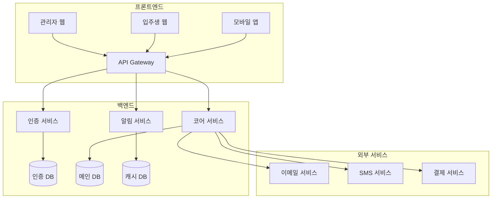

### 1.2.2 데이터 흐름도
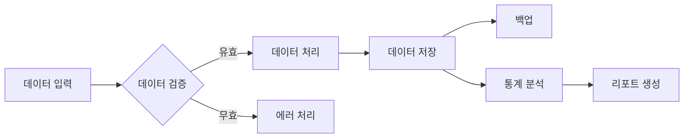

## 1.3 용어 정의

| 용어 | 설명 | 비고 |
|------|------|------|
| 사감 | 기숙사의 전반적인 운영을 책임지는 관리자 | 최고 관리자 권한 |
| 조교 | 사감을 보조하며 실무를 담당하는 관리자 | 제한된 관리자 권한 |
| 입주생 | 기숙사에 거주하는 학생 | 일반 사용자 권한 |
| 상벌점 | 입주생의 행동에 대한 평가 점수 | 누적 관리 |
| 외박 | 기숙사 밖에서 숙박하는 것 | 사전 승인 필요 |
| 점호 | 입주생 거주 확인을 위한 점검 | 일일 진행 |
| 사생회 | 입주생들의 자치 조직 | 건의사항 전달 역할 |

## 1.4 주요 기능 구조

### 1.4.1 입주생 관리 시스템
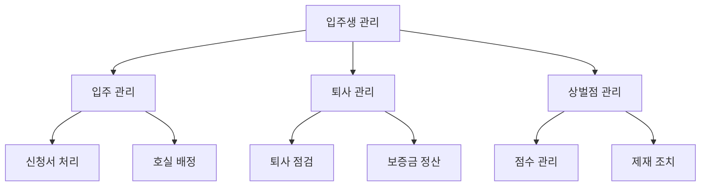

### 1.4.2 시설 관리 시스템
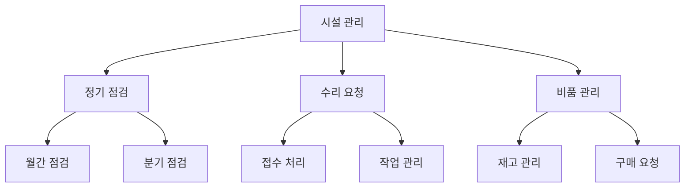

### 1.4.3 통합 관리 구조
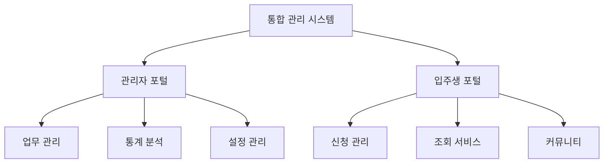

# 2. 입주생 관리 요구사항

## 2.1 입주생 등록 (STU-001)

### 2.1.1 프로세스 흐름도
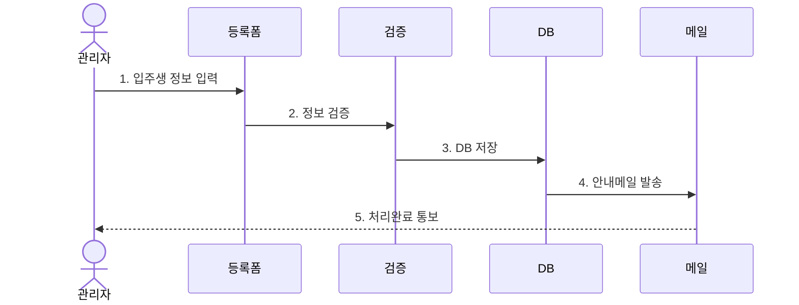

### 2.1.2 세부 기능 요구사항

#### 1) 기본 정보 등록
- **필수 정보**
  * 학번/학과/학년
  * 이름/생년월일
  * 연락처/이메일
  * 주소/보호자 연락처
  * 입사 희망 기간
- **선택 정보**
  * 룸메이트 희망
  * 식단 선호도
  * 알레르기/지병
  * 차량 정보

#### 2) 호실 배정 관리
- **배정 기준**
  * 성별/학년 구분
  * 단과대학 분포
  * 생활 패턴 매칭
  * 특이사항 고려
- **배정 프로세스**
  * 우선순위 적용
  * 자동/수동 배정
  * 변경 이력 관리
  * 만실 대기 처리

#### 3) 서류 관리
- **필수 서류**
  * 건강검진 결과
  * 서약서
  * 결핵검사 결과
  * 입사 신청서
- **서류 처리**
  * 전자 제출 시스템
  * OCR 자동 인식
  * 유효성 검증
  * 보안 저장

#### 4) 비품 관리
- **체크리스트**
  * 기본 비품 목록
  * 상태 점검 항목
  * 추가 비품 신청
  * 보증금 관련 항목
- **이력 관리**
  * 입주 시 상태
  * 정기 점검 기록
  * 파손/분실 기록
  * 퇴사 시 확인

## 2.2 상벌점 관리 (STU-002)

### 2.2.1 처리 흐름도
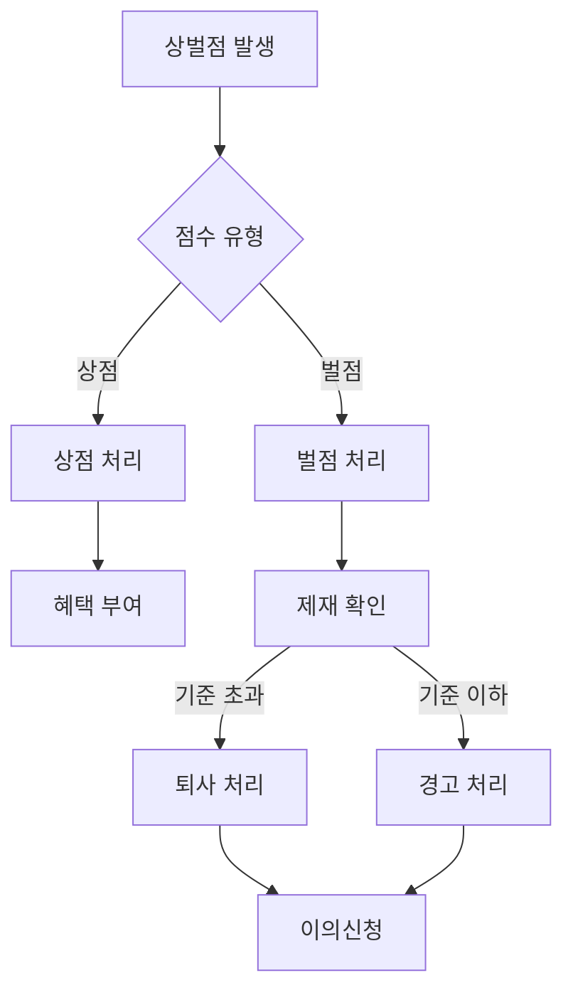

### 2.2.2 세부 기능 요구사항

#### 1) 상벌점 기준 관리
- **상점 항목**
  * 봉사활동 참여
  * 프로그램 참여
  * 모범 행동
  * 건의사항 채택
- **벌점 항목**
  * 시설물 파손
  * 소음 발생
  * 외박 규정 위반
  * 금지물품 반입

#### 2) 점수 처리 시스템
- **부여 프로세스**
  * 사유 선택/입력
  * 증빙자료 등록
  * 처리자 정보
  * 알림 발송
- **이력 관리**
  * 실시간 현황
  * 누적 통계
  * 학기별 집계
  * 리포트 생성

#### 3) 제재 조치 관리
- **기준별 조치**
  * 경고 단계 설정
  * 제재 내용 정의
  * 적용 기간 설정
  * 해제 조건
- **자동화 시스템**
  * 기준점 도달 알림
  * 조치 자동 적용
  * 담당자 통보
  * 이력 기록

#### 4) 이의신청 처리
- **신청 접수**
  * 신청서 양식
  * 증빙자료 첨부
  * 처리 기한 설정
  * 상태 추적
- **검토 프로세스**
  * 담당자 배정
  * 단계별 승인
  * 결과 통보
  * 조치 이행 

  # 3. 시설 관리 요구사항

## 3.1 수리 요청 관리 (FAC-001)

### 3.1.1 프로세스 흐름도
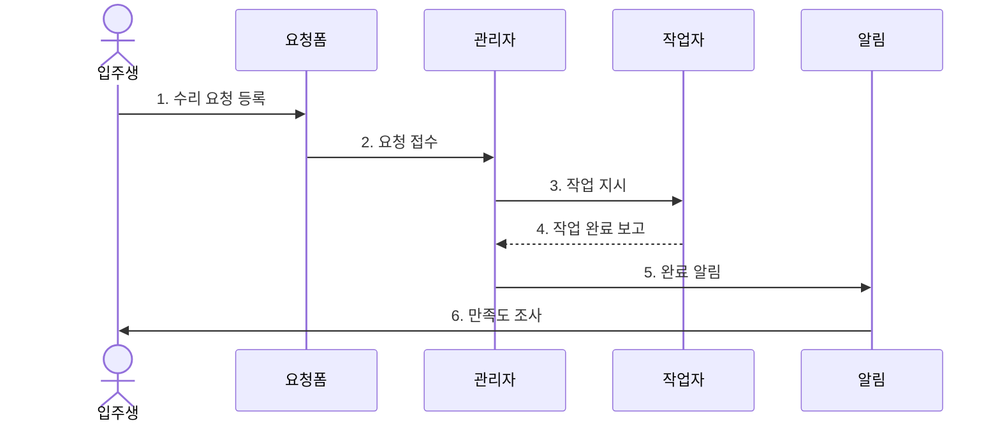

### 3.1.2 세부 기능 요구사항

#### 1) 수리 요청 접수
- **위치 정보**
  * 건물/층/호실
  * 시설물 분류
  * 구체적 위치
  * 접근 방법
- **문제 상세**
  * 증상 분류
  * 상세 설명
  * 사진 첨부
  * 긴급도 평가

#### 2) 작업 관리
- **작업 지시**
  * 작업자 배정
  * 우선순위 설정
  * 필요 부품 확인
  * 예상 소요시간
- **진행 관리**
  * 실시간 상태 추적
  * 작업 일지 작성
  * 지연 사유 등록
  * 추가 작업 요청

#### 3) 비용 관리
- **견적 관리**
  * 부품 비용
  * 인건비
  * 기타 경비
  * 예산 확인
- **정산 처리**
  * 청구 내역 작성
  * 결재 요청
  * 지출 등록
  * 영수증 관리

#### 4) 만족도 평가
- **평가 항목**
  * 처리 속도
  * 작업 품질
  * 작업자 친절도
  * 전반적 만족도
- **피드백 관리**
  * 평가 결과 분석
  * 개선점 도출
  * 작업자 피드백
  * 통계 보고서

## 3.2 시설 점검 관리 (FAC-002)

### 3.2.1 점검 프로세스
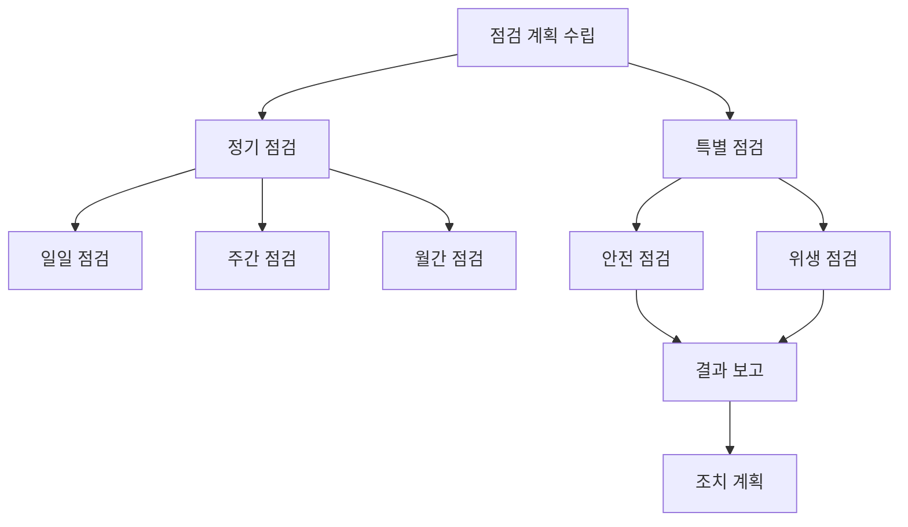

### 3.2.2 세부 기능 요구사항

#### 1) 정기 점검 계획
- **점검 일정**
  * 연간 계획 수립
  * 월간 일정 관리
  * 담당자 배정
  * 알림 설정
- **점검 항목**
  * 시설별 체크리스트
  * 중점 점검 사항
  * 계절별 특이사항
  * 이전 이력 참조

#### 2) 점검 실행
- **현장 점검**
  * 모바일 체크리스트
  * 사진 증빙
  * 실시간 기록
  * GPS 위치 확인
- **데이터 수집**
  * 센서 데이터
  * 측정값 기록
  * 이상 징후 감지
  * 트렌드 분석

#### 3) 결과 관리
- **보고서 작성**
  * 점검 결과 요약
  * 문제점 분석
  * 개선 제안
  * 우선순위 평가
- **조치 계획**
  * 즉시 조치 사항
  * 중장기 계획
  * 예산 산정
  * 실행 일정

#### 4) 이력 관리
- **데이터베이스**
  * 시설별 이력
  * 문제 패턴
  * 조치 결과
  * 비용 분석
- **통계 분석**
  * 고장 빈도
  * 수리 비용
  * 수명 예측
  * 교체 시기 

  # 4. 식단 관리 요구사항

## 4.1 식단 등록 관리 (MEAL-001)

### 4.1.1 프로세스 흐름도
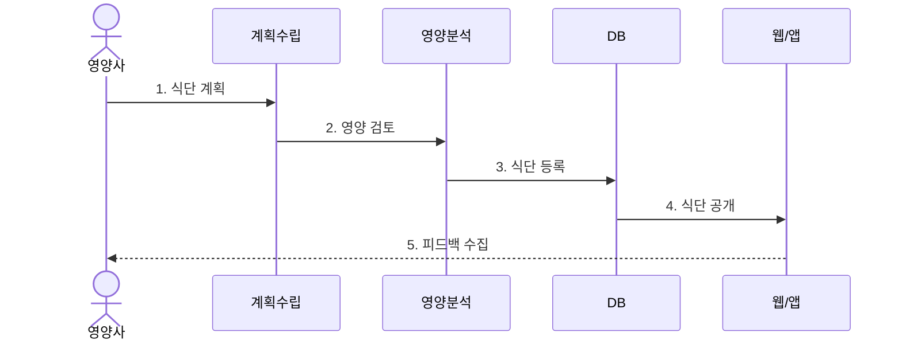

### 4.1.2 세부 기능 요구사항

#### 1) 식단 계획
- **기본 계획**
  * 주간/월간 계획
  * 식사 구성
  * 특별 식단
  * 대체 메뉴
- **메뉴 관리**
  * 계절 메뉴
  * 인기 메뉴
  * 신규 메뉴
  * 행사 식단

#### 2) 영양 관리
- **영양 분석**
  * 칼로리 계산
  * 영양소 균형
  * 알레르기 정보
  * 특이사항 관리
- **건강 고려사항**
  * 식단 다양성
  * 영양 균형
  * 식재료 품질
  * 조리 방법

#### 3) 특별 식단
- **맞춤형 식단**
  * 채식주의자
  * 알레르기 대응
  * 종교적 고려
  * 다이어트식
- **이벤트 식단**
  * 시험기간 특식
  * 계절 특식
  * 행사 식단
  * 기념일 메뉴

#### 4) 식재료 관리
- **재고 관리**
  * 발주 계획
  * 재고 현황
  * 소비 기한
  * 보관 상태
- **공급업체 관리**
  * 업체 정보
  * 계약 관리
  * 품질 평가
  * 납품 일정

## 4.2 식단 조회 시스템 (MEAL-002)

### 4.2.1 시스템 구성도
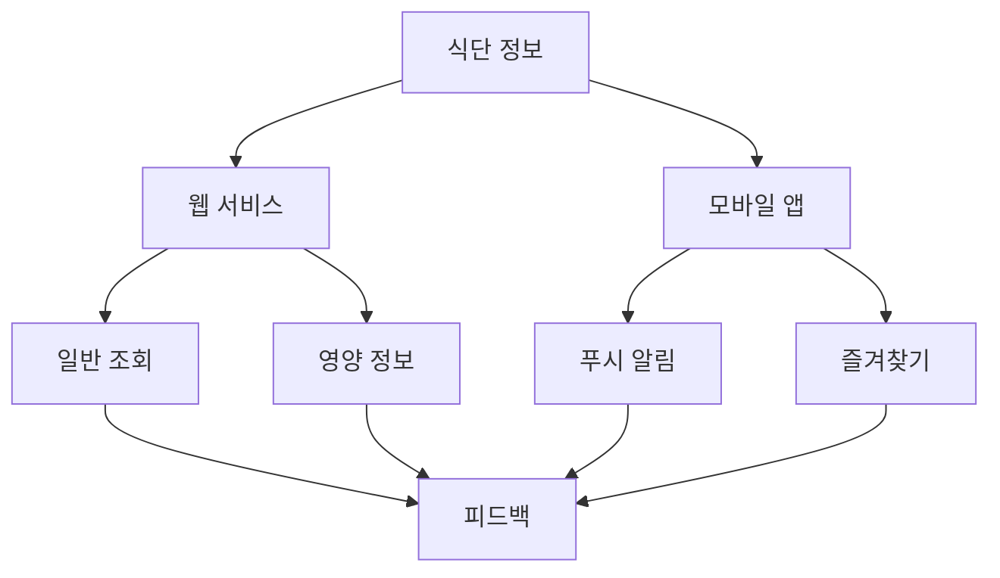

### 4.2.2 세부 기능 요구사항

#### 1) 식단 조회
- **조회 기능**
  * 일자별 보기
  * 주간 메뉴
  * 월간 캘린더
  * 식사별 분류
- **상세 정보**
  * 메뉴 설명
  * 사진 정보
  * 가격 정보
  * 제공 시간

#### 2) 영양 정보
- **기본 정보**
  * 칼로리
  * 영양소 구성
  * 알레르기 표시
  * 원산지 정보
- **건강 정보**
  * 균형도 평가
  * 건강 팁
  * 식사 가이드
  * 주의사항

#### 3) 알림 서비스
- **기본 알림**
  * 식단 변경
  * 특식 안내
  * 운영 시간
  * 휴무 안내
- **맞춤 알림**
  * 선호 메뉴
  * 알레르기 경고
  * 영양 정보
  * 이벤트 안내

#### 4) 피드백 시스템
- **평가 기능**
  * 메뉴별 평가
  * 만족도 조사
  * 코멘트 작성
  * 개선 제안
- **통계 분석**
  * 선호도 분석
  * 만족도 추이
  * 메뉴 순위
  * 개선점 도출 

  # 5. 공지사항 관리 요구사항

## 5.1 공지사항 등록 (NOT-001)

### 5.1.1 프로세스 흐름도
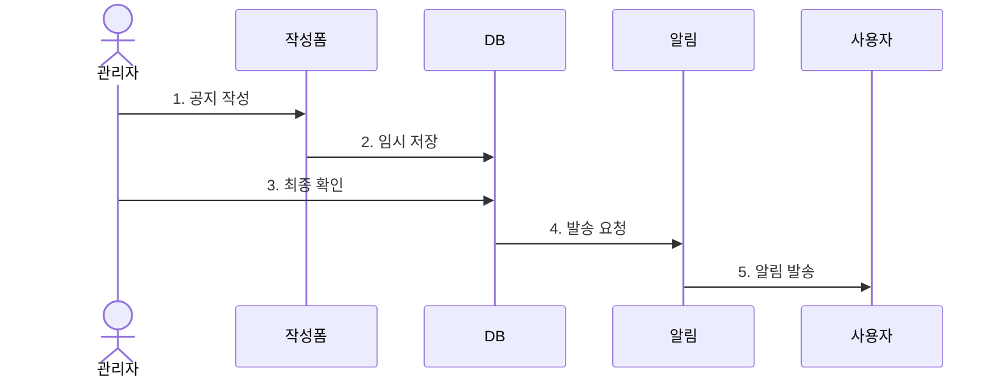

### 5.1.2 세부 기능 요구사항

#### 1) 공지 작성
- **기본 정보**
  * 제목/내용
  * 작성자 정보
  * 게시 기간
  * 대상 그룹
- **콘텐츠 관리**
  * 텍스트 에디터
  * 미디어 첨부
  * 서식 템플릿
  * 임시 저장

#### 2) 공지 분류
- **카테고리 관리**
  * 공지 유형
  * 중요도 설정
  * 태그 관리
  * 검색 키워드
- **대상 설정**
  * 전체 공지
  * 층별 공지
  * 그룹별 공지
  * 개별 공지

#### 3) 첨부파일 관리
- **파일 업로드**
  * 다중 파일
  * 용량 제한
  * 포맷 검증
  * 보안 검사
- **파일 관리**
  * 버전 관리
  * 다운로드 통계
  * 만료 설정
  * 접근 권한

#### 4) 게시 관리
- **게시 설정**
  * 즉시 게시
  * 예약 게시
  * 기간 설정
  * 노출 순서
- **알림 설정**
  * 푸시 알림
  * 이메일 발송
  * SMS 발송
  * 앱 알림

## 5.2 공지사항 관리 (NOT-002)

### 5.2.1 관리 프로세스
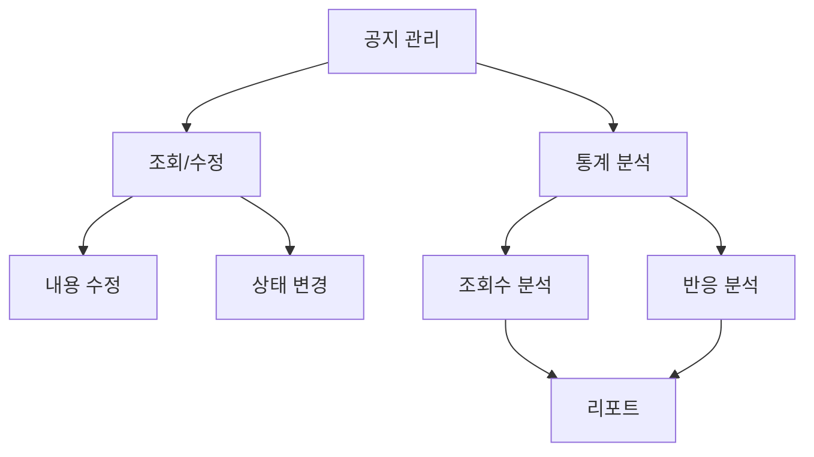

### 5.2.2 세부 기능 요구사항

#### 1) 공지 수정
- **수정 기능**
  * 내용 수정
  * 첨부파일 수정
  * 게시 기간 연장
  * 대상 변경
- **이력 관리**
  * 수정 이력
  * 버전 관리
  * 작성자 정보
  * 수정 사유

#### 2) 상태 관리
- **상태 구분**
  * 임시 저장
  * 게시 중
  * 게시 종료
  * 긴급 공지
- **노출 관리**
  * 상단 고정
  * 팝업 설정
  * 강조 표시
  * 숨김 처리

#### 3) 통계 관리
- **조회 통계**
  * 조회수 집계
  * 사용자 분석
  * 접속 경로
  * 체류 시간
- **반응 분석**
  * 좋아요/싫어요
  * 댓글 분석
  * 공유 현황
  * 만족도 조사

#### 4) 아카이브
- **보관 관리**
  * 자동 보관
  * 카테고리별 정리
  * 검색 최적화
  * 백업 관리
- **접근 관리**
  * 권한 설정
  * 열람 이력
  * 다운로드 제한
  * 보안 설정 

  # 6. 외박 관리 요구사항

## 6.1 외박 신청 관리 (OVN-001)

### 6.1.1 프로세스 흐름도
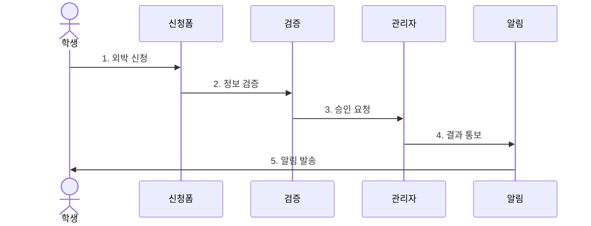

### 6.1.2 세부 기능 요구사항

#### 1) 외박 신청
- **기본 정보**
  * 신청자 정보
  * 외박 기간
  * 외박 사유
  * 체류지 정보
- **긴급 연락망**
  * 본인 연락처
  * 보호자 연락처
  * 체류지 연락처
  * 비상 연락망

#### 2) 신청 검증
- **자격 확인**
  * 벌점 현황
  * 신청 횟수
  * 제한 사항
  * 특이사항
- **정보 검증**
  * 필수 항목
  * 기간 적절성
  * 사유 타당성
  * 연락처 유효성

#### 3) 승인 처리
- **승인 기준**
  * 일반 기준
  * 특별 기준
  * 예외 사항
  * 자동 승인
- **처리 상태**
  * 접수 완료
  * 검토 중
  * 승인/거절
  * 취소/변경

#### 4) 연장 관리
- **연장 신청**
  * 사유 입력
  * 증빙 자료
  * 연장 기간
  * 긴급 연락처
- **처리 절차**
  * 즉시 처리
  * 담당자 검토
  * 조건부 승인
  * 자동 거절

## 6.2 외박 현황 관리 (OVN-002)

### 6.2.1 관리 프로세스
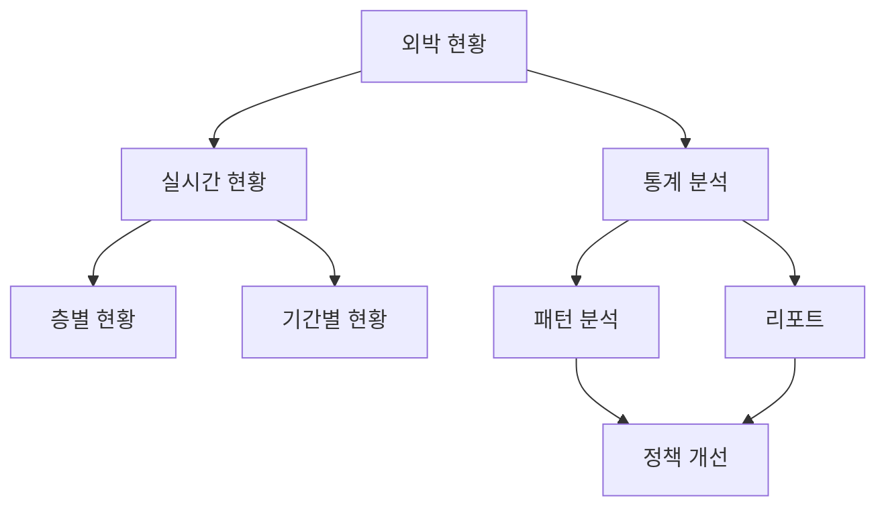

### 6.2.2 세부 기능 요구사항

#### 1) 현황 모니터링
- **실시간 현황**
  * 외박 인원
  * 층별 현황
  * 기간별 현황
  * 특이사항
- **상세 정보**
  * 학생 정보
  * 외박 정보
  * 연락처 정보
  * 승인자 정보

#### 2) 통계 분석
- **기본 통계**
  * 일별 통계
  * 주간 통계
  * 월간 통계
  * 연간 통계
- **상세 분석**
  * 사유별 분석
  * 기간별 분석
  * 학년별 분석
  * 성별 분석

#### 3) 보고서 관리
- **정기 보고**
  * 일일 보고
  * 주간 보고
  * 월간 보고
  * 특별 보고
- **분석 리포트**
  * 패턴 분석
  * 문제점 도출
  * 개선안 제시
  * 정책 제안

#### 4) 이력 관리
- **데이터베이스**
  * 신청 이력
  * 승인 이력
  * 위반 이력
  * 특이사항
- **검색 기능**
  * 조건별 검색
  * 기간별 검색
  * 학생별 검색
  * 사유별 검색 

  # 7. 비기능적 요구사항

## 7.1 성능 요구사항

### 7.1.1 응답 시간
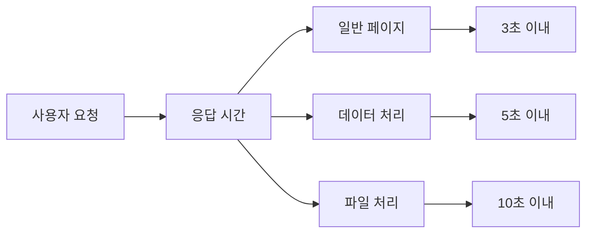

- **페이지 로딩**
  * 일반 페이지: 3초 이내
  * 데이터 집계: 5초 이내
  * 파일 업로드: 10초 이내
  * 리포트 생성: 15초 이내

- **동시 접속**
  * 일반 시간대: 300명
  * 피크 시간대: 500명
  * 특수 상황: 1000명
  * 안정성 보장: 99.9%

### 7.1.2 데이터 처리
- **트랜잭션 처리**
  * 초당 처리량: 100TPS
  * 대기열 관리
  * 우선순위 처리
  * 부하 분산

- **데이터 백업**
  * 자동 백업: 일 1회
  * 증분 백업: 시간당
  * 복구 시간: 1시간 이내
  * 보관 기간: 5년

## 7.2 보안 요구사항

### 7.2.1 인증 및 권한
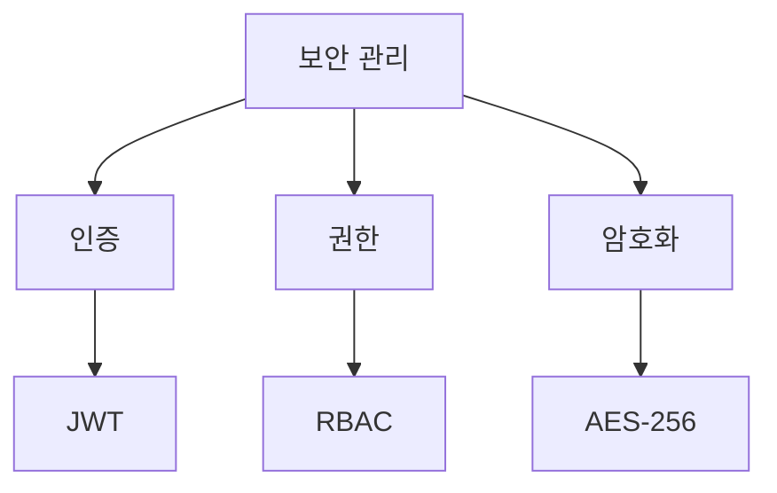

- **사용자 인증**
  * JWT 기반 인증
  * SSO 연동
  * 2단계 인증
  * 세션 관리

- **접근 제어**
  * RBAC 모델
  * 메뉴별 권한
  * IP 제한
  * 이력 추적

### 7.2.2 데이터 보안
- **암호화**
  * 통신 구간: SSL/TLS
  * 저장 데이터: AES-256
  * 개인정보: 양방향
  * 비밀번호: 단방향

- **보안 감사**
  * 접근 로그
  * 작업 이력
  * 변경 추적
  * 이상 탐지

## 7.3 사용성 요구사항

### 7.3.1 UI/UX
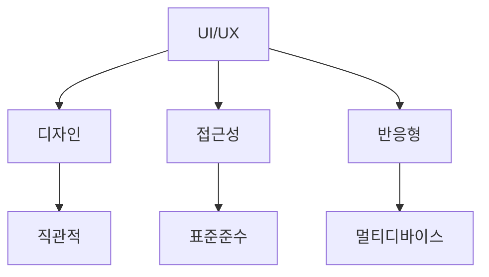

- **화면 설계**
  * 직관적 네비게이션
  * 일관된 디자인
  * 사용자 피드백
  * 도움말 시스템

- **접근성**
  * 웹 표준 준수
  * 장애인 접근성
  * 다국어 지원
  * 문서 지원

### 7.3.2 호환성
- **브라우저**
  * Chrome 최신
  * Safari 최신
  * Edge 최신
  * Firefox 최신

- **디바이스**
  * PC 웹
  * 모바일 웹
  * 태블릿
  * 앱 연동

## 7.4 기술 스택

### 7.4.1 프론트엔드

| 기술 | 버전 | 용도 | 대안 |
|------|------|------|------|
| React | 18.2.0 | UI 프레임워크 | Vue.js |
| TypeScript | 5.0.0 | 정적 타입 | JavaScript |
| Zustand | 4.4.1 | 상태 관리 | Redux |
| TailwindCSS | 3.3.0 | 스타일링 | Styled-Components |

### 7.4.2 백엔드
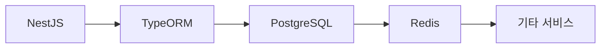

| 기술 | 버전 | 용도 | 대안 |
|------|------|------|------|
| NestJS | 10.0.0 | 백엔드 프레임워크 | Express |
| TypeORM | 0.3.17 | ORM | Prisma |
| PostgreSQL | 15.0 | 주 데이터베이스 | MySQL |
| Redis | 7.0 | 캐시/세션 | Memcached |

### 7.4.3 개발 도구
- **IDE/에디터**
  * VSCode
  * WebStorm
  * Vim
  * Sublime Text

- **버전 관리**
  * Git
  * GitHub
  * GitLab
  * Bitbucket

- **문서화**
  * Swagger
  * Storybook
  * Markdown
  * Notion

- **테스트**
  * Jest
  * Cypress
  * Postman
  * JMeter 

  